# Flujo de creación de procesos

Reversing de la cadena completa que dispara la apertura de un archivo desde `hello.exe`, aislando cada función una por una con `i386kd` y reconstruyéndolas en Ghidra: `NtOpenFile` → `IoCreateFile` → `ObOpenObjectByName`. Primer tramo del camino que termina, más adelante, en `NtCreateProcess`.

---

## Parte 1 — NtOpenFile: wrapper delgado sobre IoCreateFile

### Firma de la función

`NtOpenFile` recibe **6 parámetros** (stdcall):

```c
NTSTATUS NtOpenFile(
    OUT PHANDLE            FileHandle,
    IN  ACCESS_MASK        DesiredAccess,
    IN  POBJECT_ATTRIBUTES ObjectAttributes,
    OUT PIO_STATUS_BLOCK   IoStatusBlock,
    IN  ULONG              ShareAccess,
    IN  ULONG              OpenOptions
);
```

### `NtOpenFile` es un wrapper delgado

Un **wrapper** es una función que no tiene lógica propia — solo prepara los datos y se los pasa a otra función que hace el trabajo real, a veces agregando valores por defecto que la función interna necesita pero que el wrapper no expone al caller. Acá, `NtOpenFile` recibe sus 6 parámetros, arma un `push` por cada uno de los **14 parámetros** que espera `IoCreateFile` — 6 reenviados tal cual (`FileHandle`, `DesiredAccess`, `ObjectAttributes`, `IoStatusBlock`, `ShareAccess`, `OpenOptions`→`CreateOptions`) y los 8 restantes completados con constantes fijas (`FILE_OPEN`, `CreateFileTypeNone`, `NULL`, `0`) — y llama a `IoCreateFile` directo. Es, literalmente, una cadena de `push`/`push`/`push`/`call` sin ningún `if` de por medio.

La firma completa de `IoCreateFile` y el detalle de qué constante llena cada uno de esos 8 parámetros están en la Parte 2.

---

## Parte 2 — IoCreateFile

### 1. Reconstrucción de tipos DDK auténticos para Ghidra

El primer obstáculo fue que Ghidra no conoce los tipos NT internos (`IO_STATUS_BLOCK`, `OBJECT_ATTRIBUTES`, `KPROCESSOR_MODE`, etc.). Los headers modernos de WDK no sirven porque las estructuras cambiaron. Necesitamos los headers originales de **NT DDK octubre 1994**.

#### Proceso para generar el `.gdt`

```bash
# 1. Crear symlinks en minúscula para los headers en mayúscula
for dir in ddk_extract/INC vc_extract/INCLUDE; do
  (cd "$dir" && for f in *; do
    lower=$(echo "$f" | tr '[:upper:]' '[:lower:]')
    [ "$f" != "$lower" ] && [ ! -e "$lower" ] && ln -s "$f" "$lower"
  done)
done

# 2. Preprocesar a un .h plano con gcc -E
gcc -E -xc -I ddk_extract/INC -I vc_extract/INCLUDE \
    -D_X86_ -Di386 ntddk_wrapper.c -o ntddk_flat.i

# 3. Limpiar líneas # y __declspec
sed -i -E \
  -e '/^# [0-9]/d' \
  -e '/^#pragma/d' \
  -e 's/__declspec\([^)]*\)//g' ntddk_flat.i

# Renombrar para que Ghidra lo acepte
cp ntddk_flat.i ntddk_flat.h
```

**`ntddk_wrapper.c`** incluye `<ntddk.h>` y agrega manualmente el prototipo de `IoCreateFile` (no está declarado en el DDK público de 1994, solo aparece en comentarios):

```c
NTSTATUS
IoCreateFile(
    OUT PHANDLE FileHandle,
    IN ACCESS_MASK DesiredAccess,
    IN POBJECT_ATTRIBUTES ObjectAttributes,
    OUT PIO_STATUS_BLOCK IoStatusBlock,
    IN PLARGE_INTEGER AllocationSize OPTIONAL,
    IN ULONG FileAttributes,
    IN ULONG ShareAccess,
    IN ULONG Disposition,
    IN ULONG CreateOptions,
    IN PVOID EaBuffer OPTIONAL,
    IN ULONG EaLength,
    IN CREATE_FILE_TYPE CreateFileType,
    IN PVOID ExtraCreateParameters OPTIONAL,
    IN ULONG Options
    );
```

Luego en Ghidra: **File → Parse C Source** → agregar `ntddk_flat.h` → **Parse to Program** → guarda como `nt31_ddk.gdt` en el Data Type Manager.

Firma resultante en el Decompile de Ghidra, con los tipos DDK ya aplicados:

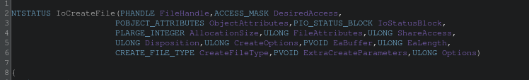

### 3. Determinación de RequestorMode

Lo primero que hace la función es saber desde dónde fue llamada: ¿kernel o usermode?

```c
// Leer PreviousMode del KTHREAD actual
// FS:[0x124] = KPCR->PrcbData.CurrentThread (puntero al KTHREAD)
// KTHREAD+0x1d4 = PreviousMode (KPROCESSOR_MODE)
local_5 = *(char *)(unaff_FS_OFFSET[0x49] + 0x1d4);

// Flag IO_NO_PARAMETER_CHECKING (0x100):
// Si está presente, forzar KernelMode sin importar el caller real
if ((param_14 & 0x100) != 0) {
    local_5 = '\0';  // KernelMode = 0
}
```

### 4. Estructura SEH — el frame de excepción MSVC

`IoCreateFile` usa `__try/__except` para proteger los accesos a memoria de usermode. El compilador MSVC para x86 implementa esto con una cadena de registros de excepción instalados en `FS:[0]`.

Ghidra muestra los valores hardcodeados antes de instalar el frame:

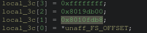

Assembly real capturado con `i386kd` mostrando cómo el compilador instala el frame en `FS:[0]`:

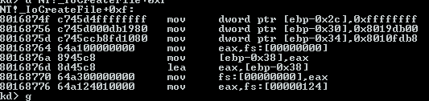

#### ScopeTable en `0x8019db00`

La ScopeTable describe los dos bloques `__try` independientes de la función:

```
kd> dd 8019db00 L6
8019db00: ffffffff 801688b8 801688c8
8019db0c: ffffffff 801689c6 801689d6
```

### 5. Flujo del else — rama UserMode

Cuando `RequestorMode == UserMode` (≠ `'\0'`), la función debe validar que todos los punteros que recibió de usermode son realmente escribibles antes de usarlos. Progresión completa del bloque en Ghidra — desde el primer pase (`func_0x...` sin renombrar) hasta las cuatro funciones ya identificadas (`ProbeAndWriteHandle`, `ProbeForWrite`, `RtlConvertLongToLargeInteger`, `ProbeForRead`) y el panel de Listing correlacionando la dirección real:

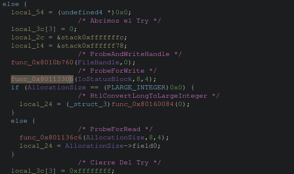

#### ¿Qué hace `Probe` realmente?

Es clave no confundir esto: **`Probe` no copia nada, solo valida** — es un gate de permisos que corre *antes* de tocar la memoria. Para cada rango `[Address, Address+Length)` verifica tres cosas:

1. **Que la dirección caiga en espacio de usermode** (por debajo de `0x80000000` en este build) y no en espacio del kernel. Esto es lo central: el kernel corre con acceso total a *toda* la memoria, kernel y usuario. Sin este chequeo, un proceso podría pasar una dirección del kernel disfrazada de "mi handle de salida", y el kernel — que tiene permiso de sobra — terminaría escribiendo ahí a pedido de usermode. `Probe` es lo que bloquea ese primitivo de escalada de privilegios.
2. **Alineación** — el `4` que se repite en cada llamada, acorde al tipo que se está validando.
3. **Que la página esté presente y con el permiso correcto** (legible para `ProbeForRead`, escribible para `ProbeForWrite`) — si no lo está, ahí es donde salta `STATUS_ACCESS_VIOLATION`, capturado por el `__try/__except` de la Sección 4. El frame SEH existe *específicamente* para esto.

La copia a una variable local (`local_24 = AllocationSize->field0`, o el `*FileHandle = 0` de más abajo) es un paso **separado**, que hace `IoCreateFile` recién después de que `Probe` dio el visto bueno — es la defensa contra TOCTOU (*time-of-check to time-of-use*): otro hilo del mismo proceso podría modificar o desmapear esa memoria microsegundos después de validada, así que el valor se copia a memoria del kernel (fuera del alcance de usermode) una sola vez y el resto de la función ya no vuelve a tocar el puntero original.

#### ProbeAndWriteHandle (`0x8010b760`)

Confirmado con `i386kd` — disassembly real:

```
NT!_ProbeAndWriteHandle:
8010b760  push    esi
8010b761  cmp byte ptr [NT!_MmCheckPteOnProbe], 0x0
8010b768  jz      +0x18
8010b76a  mov     esi, [esp+0x8]      ; esi = Address (FileHandle)
8010b76e  push    0x4                 ; alignment
8010b770  push    esi                 ; Address
8010b771  call    NT!_MmProbeForWrite ; valida escribibilidad
8010b776  jmp     +0x2f               ; → escribir el valor
```

Verifica que `MmCheckPteOnProbe` esté activo, llama a `MmProbeForWrite(Address, 4)` para garantizar que el puntero pertenece a usermode y es escribible, luego escribe `0` como valor inicial en `*FileHandle`.

#### ProbeForWrite (`0x80113306`)

Llamada como `ProbeForWrite(IoStatusBlock, 8, 4)`:
- Puntero: `IoStatusBlock`
- Longitud: `8` bytes (tamaño de `IO_STATUS_BLOCK`)
- Alineación: `4` bytes

Valida que `IoStatusBlock` está completamente en espacio de usuario y es escribible.

### 6. Flujo completo de IoCreateFile

```
IoCreateFile(FileHandle, DesiredAccess, ObjectAttributes, IoStatusBlock,
             AllocationSize, FileAttributes, ShareAccess, Disposition,
             CreateOptions, EaBuffer, EaLength, CreateFileType,
             ExtraCreateParameters, Options)
│
├─ 1. Leer KTHREAD->PreviousMode desde FS:[0x124]+0x1d4
│     Si Options & 0x100 (IO_NO_PARAMETER_CHECKING) → forzar KernelMode
│
├─ 2. Si KernelMode → sin validaciones (el kernel se fía de sí mismo)
│
└─ 3. Si UserMode:
      ├─ Abrir try#0 (TryLevel = 0)
      ├─ ProbeAndWriteHandle(FileHandle, 0)     → pre-zerear + validar
      ├─ ProbeForWrite(IoStatusBlock, 8, 4)     → validar IoStatusBlock
      ├─ Si AllocationSize == NULL → RtlConvertLongToLargeInteger(0)
      │  Si no  → ProbeForRead(AllocationSize, 8, 4) + copiar a local_24
      ├─ Validación gigante de FileAttributes/ShareAccess/Disposition/CreateOptions/
      │  DesiredAccess → si algo no cierra, STATUS_INVALID_PARAMETER (Sección 8)
      ├─ Si CreateFileType != None → validar NamedPipe/Mailslot (Sección 9)
      ├─ Si EaBuffer != NULL:
      │   └─ Abrir try#1 (TryLevel = 1)
      │       ProbeForRead(EaBuffer, EaLength) + copiar al kernel heap
      └─ Llamar IopCreateFile(...)  ← el trabajo real
```

**Idea central:** `IoCreateFile` es un guardia de seguridad. Valida que los punteros de usermode son legítimos antes de pasarlos al motor real (`IopCreateFile`), todo protegido con `__try/__except` para capturar cualquier acceso inválido.

### 7. Flags internos (parámetro `Options`)

Definidos en `NTDDK.H` (DDK octubre 1994):

```c
#define IO_FORCE_ACCESS_CHECK    0x0001
#define IO_OPEN_PAGING_FILE      0x0002
#define IO_OPEN_TARGET_DIRECTORY 0x0004
// 0x0100 = IO_NO_PARAMETER_CHECKING (interno, no declarado públicamente)
```

El flag `0x100` es el único que afecta el flujo de `IoCreateFile` directamente: fuerza `KernelMode` saltando todas las validaciones de usermode.

### 8. Validación de parámetros — el `if` gigante

Antes de tocar `EaBuffer` o llamar a `IopCreateFile`, la función corre un único `if` con toda la validación cruzada de `FileAttributes`, `ShareAccess`, `Disposition`, `CreateOptions` y `DesiredAccess`. Si cualquier condición da cierto, corta con `STATUS_INVALID_PARAMETER`:

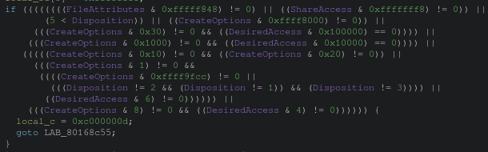

`0xc000000d` está confirmado en `NTSTATUS.H` del DDK:

```c
#define STATUS_INVALID_PARAMETER         ((NTSTATUS)0xC000000DL)
```

`LAB_80168c55` es el punto de salida de error común de la función — cierra el `__try` y retorna sin haber llamado nunca a `IopCreateFile`.

#### 1. Validez individual de cada campo

**`(FileAttributes & 0xfffff848) != 0`** — complemento de `0x7B7`. Confirmado contra `winnt.h`, calza exacto con los 9 atributos válidos del DDK de 1994:

```c
#define FILE_ATTRIBUTE_READONLY         0x00000001
#define FILE_ATTRIBUTE_HIDDEN           0x00000002
#define FILE_ATTRIBUTE_SYSTEM           0x00000004
#define FILE_ATTRIBUTE_DIRECTORY        0x00000010
#define FILE_ATTRIBUTE_ARCHIVE          0x00000020
#define FILE_ATTRIBUTE_NORMAL           0x00000080
#define FILE_ATTRIBUTE_TEMPORARY        0x00000100
#define FILE_ATTRIBUTE_ATOMIC_WRITE     0x00000200
#define FILE_ATTRIBUTE_XACTION_WRITE    0x00000400
```

**`(ShareAccess & 0xfffffff8) != 0`** — complemento de `0x7`. El header solo documenta dos flags públicos:

```c
#define FILE_SHARE_READ                 0x00000001
#define FILE_SHARE_WRITE                0x00000002
```

**`(5 < Disposition)`** — a diferencia de los anteriores no es una máscara de bits, es un rango: `Disposition` es un valor enumerado secuencial (`0`-`5`), y el header confirma el límite con su propia constante:

```c
#define FILE_MAXIMUM_DISPOSITION        0x00000005
```

**`(CreateOptions & 0xffff8000) != 0`** — complemento exacto de una constante que el propio DDK ya nombra:

```c
#define FILE_VALID_OPTION_FLAGS          0x00007FFF
```

#### Bloque especial: apertura de directorios

**`(CreateOptions & 1) != 0`** (`FILE_DIRECTORY_FILE`) actúa como *gate*, no como negación — activa un sub-bloque de reglas que solo aplican cuando se pide explícitamente un directorio:

**`(CreateOptions & 0xffff9fcc) != 0`** — complemento de `0x6033`, que son exactamente estos seis flags:

```
0x0001  FILE_DIRECTORY_FILE
0x0002  FILE_WRITE_THROUGH
0x0010  FILE_SYNCHRONOUS_IO_ALERT
0x0020  FILE_SYNCHRONOUS_IO_NONALERT
0x2000  FILE_OPEN_BY_FILE_ID
0x4000  FILE_OPEN_FOR_BACKUP_INTENT
```

Cualquier otro bit de `CreateOptions` (buffering, oplocks, EAs — todo lo que aplica a *contenido* de archivo, no a un directorio) es inválido acá. De yapa, esto atrapa sin chequeo aparte la contradicción `FILE_DIRECTORY_FILE` + `FILE_NON_DIRECTORY_FILE` (`0x40`), porque `0x40` tampoco está en el set válido.

**`Disposition != 2 && Disposition != 1 && Disposition != 3`** — para un directorio solo se permiten `FILE_OPEN`, `FILE_CREATE`, `FILE_OPEN_IF`. Los tres rechazados (`FILE_SUPERSEDE`, `FILE_OVERWRITE`, `FILE_OVERWRITE_IF`) implican reemplazar/truncar contenido — algo que no existe para un directorio.

**`(DesiredAccess & 6) != 0`** — `FILE_ADD_FILE`/`FILE_ADD_SUBDIRECTORY` (mismos bits que `FILE_WRITE_DATA`/`FILE_APPEND_DATA`, pero renombrados para un directorio según `winnt.h`). *(Hipótesis, no confirmada)*: probablemente estos derechos se evalúan contra el ACL del directorio cuando alguien más tarde crea algo adentro (abriendo el path hijo), no algo que tenga sentido pedir directamente al abrir el handle del directorio en sí.

### 9. Validación específica por `CreateFileType` (NamedPipe / Mailslot)

Un segundo bloque de validación, estructuralmente separado del `if` gigante de la Sección 8, cubre los dos tipos especiales de `CreateFileType` (`CreateFileTypeNone = 0`, `CreateFileTypeNamedPipe = 1`, `CreateFileTypeMailslot = 2`, confirmado en `NTDDK.H`):

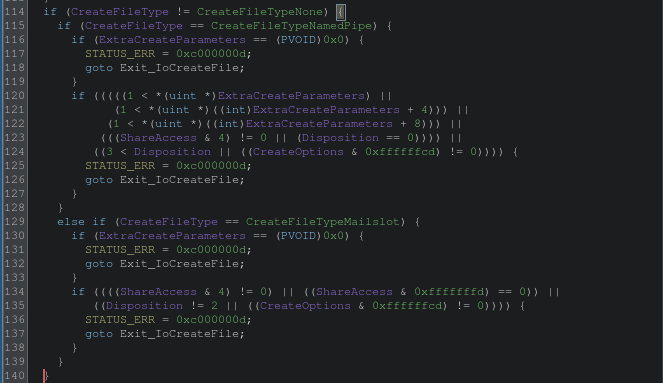

### 10. Bloque `EaBuffer` — try#1 (última parte de la rama UserMode)

Última pieza de la rama `else` (`UserMode`) que arrancó en la Sección 5 — el segundo bloque `__try` independiente de la ScopeTable (Sección 4, `TryLevel = 1`), justo antes de armar los parámetros para el motor real de creación:

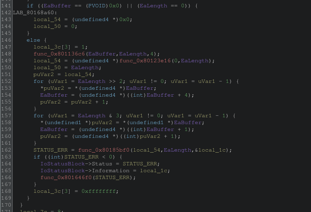

**Qué es `EaBuffer`:** parámetro 10, `PVOID` opcional a una cadena de **Extended Attributes** (EAs) — un resabio directo del **HPFS de OS/2**, heredado por compatibilidad con el subsistema OS/2 de NT. Cada EA es una `FILE_FULL_EA_INFORMATION` (confirmado en `NTDDK.H`: `NextEntryOffset`, `Flags`, `EaNameLength`, `EaValueLength`, `EaName[]` seguido del valor crudo), encadenadas entre sí. `EaLength` (parámetro 11) es el tamaño total en bytes de la cadena.

### 11. Armado del `OPEN_PACKET` y llamada a `ObOpenObjectByName`

Con todas las validaciones pasadas, `IoCreateFile` arma la estructura que finalmente cruza la frontera hacia el Object Manager:

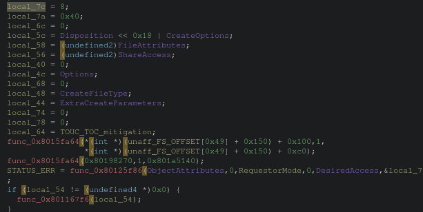

#### El `OPEN_PACKET`

`local_7c` en adelante no son variables sueltas — es una sola estructura armada en el stack y pasada por referencia (`&local_7c`) al final. La evidencia: se escriben todas en secuencia justo antes de una única llamada que recibe esa dirección, y ninguna se vuelve a leer después dentro de la misma función — el "lector" real es la función a la que se le pasa el puntero, no `IoCreateFile`.

`local_7c = 8` confirma qué estructura es exactamente — coincide con una constante real de `NTDDK.H`:

```c
#define IO_TYPE_OPEN_PACKET             0x00000008
```

Es un **`OPEN_PACKET`**: la estructura interna que el I/O Manager arma para pasarle al Object Manager genérico toda la información específica de creación de archivos. `local_7a = 0x40` acompaña a `Type` como el campo `Size` (mismo patrón de header `Type`+`Size` que usan otras estructuras visibles del Object Manager). Entre los campos que se ven armados: `local_5c = Disposition << 0x18 | CreateOptions` — empaqueta los dos en un solo `ULONG` (`Disposition` cabe en el byte alto porque nunca pasa de `5`, `CreateOptions` nunca pasa de 15 bits válidos según `FILE_VALID_OPTION_FLAGS` — Sección 8 — así que no hay superposición posible), además de `FileAttributes`, `ShareAccess`, `Options`, `CreateFileType` y `ExtraCreateParameters` copiados directo.

#### Los dos `ExInterlockedAddUlong` — contabilidad, no sincronización nueva

Justo antes de la llamada final, dos incrementos atómicos de contadores de estadísticas de I/O — confirmado con `i386kd` (símbolos reales vía `ln`):

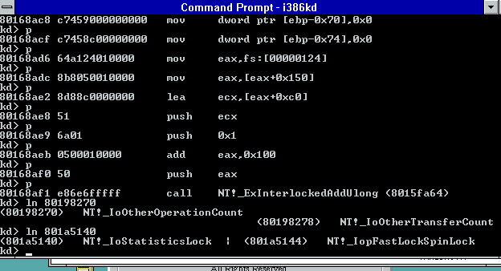

```c
ULONG
ExInterlockedAddUlong (
    IN PULONG      Addend,
    IN ULONG       Increment,
    IN PKSPIN_LOCK Lock
    );
```

Primitivo de sincronización de bajo nivel: suma `Increment` a `*Addend` de forma atómica, tomando el spinlock `Lock` — evita que dos CPUs pisen el mismo contador en un kernel SMP.

- **Primera llamada** — `Addend`/`Lock` calculados desde `FS:[0x124]` (el `KTHREAD` actual, Sección 3) → `*(KTHREAD+0x150)` (casi con certeza `ApcState.Process`, puntero al `EPROCESS`) → `+0x100`/`+0xc0`. Sin header público que confirme los nombres exactos (`EPROCESS`/`KTHREAD` son opacos en este DDK), pero es un contador **por proceso**.
- **Segunda llamada** — direcciones fijas, confirmadas con `ln`:
  ```
  kd> ln 80198270
  (80198270)   NT!_IoOtherOperationCount
  kd> ln 801a5140
  (801a5140)   NT!_IoStatisticsLock
  ```
  `IoOtherOperationCount` es un contador **global** real del I/O Manager — la familia `IoReadOperationCount`/`IoWriteOperationCount`/`IoOtherOperationCount` cuenta operaciones de I/O por tipo; crear/abrir un archivo cae en "otra". Mismo offset relativo (`+0x100`/`+0xc0`) que la llamada por-proceso — mismo layout de contadores, una copia global y una por proceso.

Ninguna de las dos llamadas crea un mecanismo de sincronización nuevo — el spinlock ya existe de antes; esto solo lo usa para anotar, de forma segura, que acá pasó una operación de I/O de tipo "otra".

#### La llamada a `ObOpenObjectByName`

```c
STATUS_ERR = func_0x80125f86(ObjectAttributes, 0, RequestorMode, 0, DesiredAccess, &local_7c, &local_18);
```

7 argumentos, match exacto con la firma real (no pública, pero bien documentada en la literatura de NT internals) de `ObOpenObjectByName`:

```c
NTSTATUS ObOpenObjectByName(
    POBJECT_ATTRIBUTES ObjectAttributes,
    POBJECT_TYPE       ObjectType,       // 0 — se resuelve por nombre, no se fuerza
    KPROCESSOR_MODE     AccessMode,      // RequestorMode
    PACCESS_STATE       AccessState,     // 0 — sin AccessState pre-armado
    ACCESS_MASK         DesiredAccess,
    PVOID                ParseContext,   // &local_7c — el OPEN_PACKET
    PHANDLE              Handle          // &local_18 — handle de salida
);
```

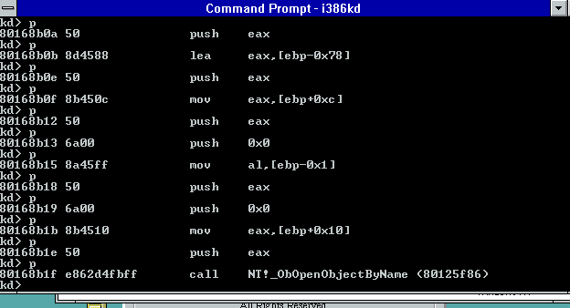

Es el punto donde `IoCreateFile` entrega el control al Object Manager genérico — `ObpLookupObjectName` (ver Parte 3) resuelve el path, y cuando llega al filesystem driver, el `ParseContext` (`OPEN_PACKET`) es lo que le dice qué hacer específicamente con el archivo.

Al final del bloque, si se había reservado un buffer de EA en la Sección 10 (`local_54 != NULL`), se libera con `func_0x801167f6(local_54)` — pendiente de confirmar el nombre (candidato natural: `ExFreePool`) y de entender exactamente en qué punto se consumió ese buffer antes de liberarlo.

### 12. Epílogo — procesar el resultado y desarmar el frame SEH

Última parte de la función: qué hace `IoCreateFile` con lo que devolvió `ObOpenObjectByName`, y cómo cierra el `__try/__except` de la Sección 4 antes de retornar.

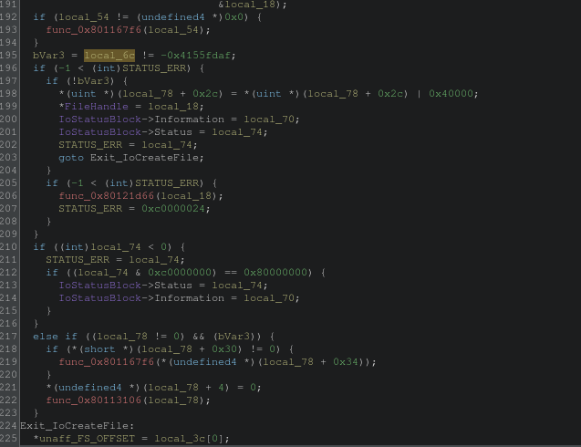

#### `NT_SUCCESS`, confirmado

`if (-1 < (int)STATUS_ERR)` es el inline de la macro real, confirmada en `NTDEF.H`:

```c
#define NT_SUCCESS(Status) ((NTSTATUS)(Status) >= 0)
```

Comparar `> -1` como entero con signo es lo mismo que `>= 0` — el compilador lo expresa así porque los `NTSTATUS` de error tienen el bit más alto prendido (severidad `Error`), lo que los hace *negativos* al leerlos como `int`. Es el mismo truco de un solo chequeo de signo que usa toda la API de NT para distinguir éxito de error sin comparar contra un valor puntual.

#### `local_6c` — el campo que cambia dentro de `ObOpenObjectByName`

`local_6c` es un campo del `OPEN_PACKET` (Sección 11) que se inicializaba en `0` antes de la llamada — pero `ObOpenObjectByName` (o, más probablemente, la rutina de parseo del filesystem a la que el Object Manager le reenvía el `ParseContext`) le escribe un valor nuevo *adentro* de esa misma memoria antes de retornar. Confirma algo importante: el `OPEN_PACKET` no es un parámetro de solo entrada — también es un canal de **salida**, el filesystem se comunica de vuelta con `IoCreateFile` escribiendo directamente en la estructura que recibió por puntero, no solo a través del valor de retorno de la función.

#### Camino de éxito real

Con `NT_SUCCESS(STATUS_ERR)` y `local_6c` en el valor esperado:
- Prende un bit (`0x40000`) en un campo del propio `OPEN_PACKET` (`local_78+0x2c`).
- **`*FileHandle = local_18`** — recién acá se escribe el handle real en la salida del caller. Cierra el círculo con la Sección 5: `ProbeAndWriteHandle` había pre-cereado `*FileHandle` a `0` al principio de la función, como valor defensivo por si algo fallaba antes de llegar hasta acá; este es el único punto donde se sobreescribe con el handle de verdad.
- Copia `Information`/`Status` a `IoStatusBlock` y salta a `Exit_IoCreateFile`.

#### Camino de "éxito pero no es lo que esperaba"

Si `STATUS_ERR` fue éxito pero `bVar3` es cierto (el `local_6c` no matcheó): cierra el handle recién abierto (`func_0x80121d66(local_18)` — candidato natural `ZwClose`/`ObCloseHandle`) y fuerza el error a una constante confirmada en `NTSTATUS.H`:

```c
#define STATUS_OBJECT_TYPE_MISMATCH      ((NTSTATUS)0xC0000024L)
```

#### Desarme del frame SEH

La última línea de toda la función:

```c
Exit_IoCreateFile:
*unaff_FS_OFFSET = local_3c[0];
```

Cierra el círculo con la Sección 4: `local_3c[0]` es el campo `Next` del `EXCEPTION_REGISTRATION_RECORD` que se armó al entrar a la función (el puntero al frame SEH *anterior*, del caller). Restaurar `FS:[0]` a ese valor es el desarme manual del frame de excepción — sacar el propio registro de la cadena de `FS:[0]` antes de retornar, para que un `__except` de más arriba en la pila de llamadas no intente usar un frame que ya dejó de existir.

---

## Parte 3 — ObOpenObjectByName

`IoCreateFile` entrega el control al Object Manager genérico vía `ObOpenObjectByName` (`0x80125f86`), pasándole el `OPEN_PACKET` armado como `ParseContext`. Esta parte reversea esa función — el nivel siguiente de la pila.

### 1. Los 7 parámetros

Firma ya confirmada en la Parte 2 contra la llamada real desde `IoCreateFile`:

```c
NTSTATUS ObOpenObjectByName(
    POBJECT_ATTRIBUTES ObjectAttributes,
    POBJECT_TYPE        ObjectType,       // OPTIONAL
    KPROCESSOR_MODE      AccessMode,
    PACCESS_STATE         AccessState,     // OPTIONAL
    ACCESS_MASK            DesiredAccess,
    PVOID                   ParseContext,   // el OPEN_PACKET
    PHANDLE                  Handle
);
```

Detalle de cada uno, confirmado contra `ddk_extract/INC/NTDEF.H` y `NTDDK.H` (DDK octubre 1994):

#### `ObjectAttributes` — `POBJECT_ATTRIBUTES`

```c
typedef struct _OBJECT_ATTRIBUTES {
    ULONG Length;
    HANDLE RootDirectory;
    PUNICODE_STRING ObjectName;
    ULONG Attributes;
    PVOID SecurityDescriptor;
    PVOID SecurityQualityOfService;
} OBJECT_ATTRIBUTES;
```

`RootDirectory` es el ancla para nombres relativos (equivalente al `dirfd` de `openat()`); `ObjectName` es el nombre a resolver en el namespace jerárquico único del Object Manager. `Attributes` es un bitmask (`OBJ_INHERIT`, `OBJ_PERMANENT`, `OBJ_EXCLUSIVE`, `OBJ_CASE_INSENSITIVE`, `OBJ_OPENIF`). Un objeto solo necesita nombre si otro proceso no emparentado tiene que encontrarlo sin herencia ni `DuplicateHandle` explícito (el caso general de IPC por nombre: secciones/shared memory, mutexes, eventos, named pipes).

#### `ObjectType` — `POBJECT_TYPE`

```c
typedef struct _OBJECT_TYPE *POBJECT_TYPE;   // NTDDK.H:40, "types that are not exported"
```

Opaco — nunca publicado, mismo bloque que `EPROCESS`/`KTHREAD`. Es un token de verificación de tipo (`OPTIONAL`), confirmado por su uso en `ObReferenceObjectByHandle`/`ObReferenceObjectByPointer` (`NTDDK.H:8873-8888`). Acá viene `NULL` — `IoCreateFile` no sabe todavía si el nombre resuelve a archivo/directorio/dispositivo, delega el chequeo de tipo a su propia validación manual sobre `OPEN_PACKET.local_6c` (Parte 2, Sección 12) en vez de imponerlo acá.

#### `AccessMode` — `KPROCESSOR_MODE`

```c
typedef CCHAR KPROCESSOR_MODE;
typedef enum _MODE { KernelMode, UserMode, MaximumMode } MODE;
```

Es el mismo valor que `RequestorMode` (Parte 2, Sección 3 — leído de `KTHREAD->PreviousMode`), y el mismo campo que aparece dentro de `struct _IRP` (`NTDDK.H:7380`, *"mode of the original requestor of this operation"*). Se propaga hasta `SeAccessCheck` (`NTDDK.H:6560-6571`), que también toma `KPROCESSOR_MODE AccessMode` — es el mecanismo por el cual `KernelMode` saltea el chequeo de ACL (documentado en la literatura pública de NT internals, no en este DDK).

#### `AccessState` — `PACCESS_STATE`

```c
typedef struct _ACCESS_STATE {
   LUID OperationID;
   BOOLEAN SecurityEvaluated;
   BOOLEAN AuditHandleCreation;
   BOOLEAN GenerateOnClose;
   BOOLEAN PrivilegesAllocated;
   ULONG Flags;
   ACCESS_MASK RemainingDesiredAccess;
   ACCESS_MASK PreviouslyGrantedAccess;
   ACCESS_MASK OriginalDesiredAccess;
   SECURITY_SUBJECT_CONTEXT SubjectSecurityContext;
   PSECURITY_DESCRIPTOR SecurityDescriptor;
   PPRIVILEGE_SET PrivilegesUsed;
   union {
      INITIAL_PRIVILEGE_SET InitialPrivilegeSet;
      PRIVILEGE_SET PrivilegeSet;
      } Privileges;
   } ACCESS_STATE, *PACCESS_STATE;
```

Acumulador del estado de un access-check en curso (`OperationID` para auditoría — relevante en esta build, la **Advanced Server** apunta a compliance C2 —, `SubjectSecurityContext` con el token del que pide acceso). Viene `NULL` en esta llamada: le dice al Object Manager que arme el suyo desde cero (ver Sección 3 más abajo). El campo `Flags` no tiene bitmask documentado en este DDK — **pendiente, sin confirmar qué representa cada bit**.

#### `DesiredAccess` — `ACCESS_MASK`

```c
typedef ULONG ACCESS_MASK;
#define DELETE 0x00010000L
#define READ_CONTROL 0x00020000L
#define WRITE_DAC 0x00040000L
#define WRITE_OWNER 0x00080000L
#define SYNCHRONIZE 0x00100000L
#define STANDARD_RIGHTS_REQUIRED 0x000F0000L
#define GENERIC_READ 0x80000000L
#define GENERIC_WRITE 0x40000000L
#define GENERIC_EXECUTE 0x20000000L
#define GENERIC_ALL 0x10000000L
```

Layout estándar de 32 bits de NT: 16 bits bajos específicos de tipo, medio los standard rights, 4 bits altos los genéricos (traducidos vía `GenericMapping`, ver Sección 3).

#### `ParseContext` / `Handle`

`ParseContext` es el `OPEN_PACKET` ya armado en la Parte 2 (Sección 11) — blob opaco para el Object Manager, solo tiene sentido para el `ParseProcedure` del filesystem. `Handle` (`PHANDLE` = `HANDLE*`, `NTDEF.H:206-212`) es puro output: `&local_18`, el mismo que termina copiado a `*FileHandle` en el epílogo de `IoCreateFile`.

### 2. Entrada — validación y `Pointer_ObjectType`

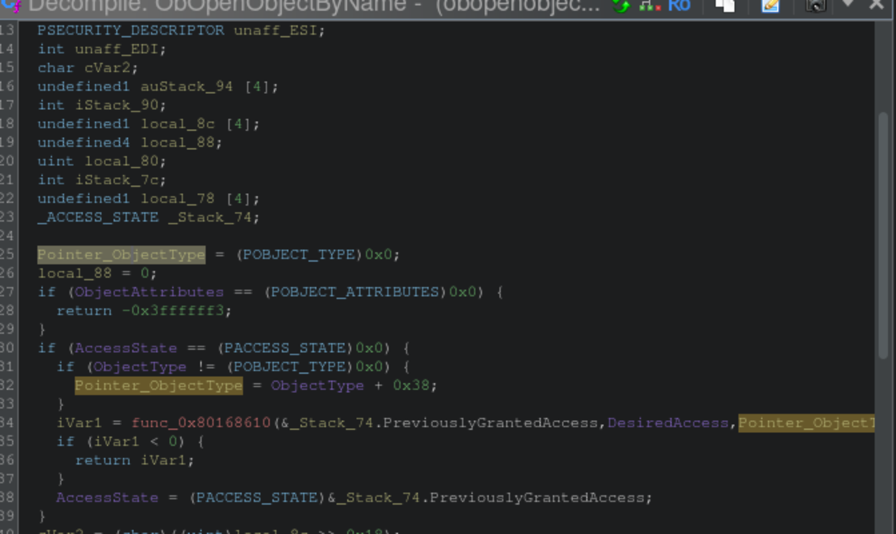

**Línea 25-26:** `Pointer_ObjectType` (local, `POBJECT_TYPE`) y `local_88` arrancan en `0` — acumuladores que se llenan más adelante, no constantes.

**Línea 27-28:** `ObjectAttributes` es el único parámetro no-`OPTIONAL` de verdad (sin nombre no hay nada que resolver) — primer chequeo defensivo, falla rápido con `STATUS_INVALID_PARAMETER` (`-0x3fffffff3` = `0xC000000D`, confirmado en `NTSTATUS.H:1081`).

**Línea 30:** `AccessState == NULL` — en nuestra llamada es cierto, entra al bloque. Confirma en vivo lo predicho: sin `ACCESS_STATE` provisto desde afuera, la función arma el suyo propio en el stack (`_Stack_74`, tipada `_ACCESS_STATE`).

**Línea 31-32:** `Pointer_ObjectType = ObjectType + 0x38` — **solo si `ObjectType` no es `NULL`** (no es nuestro caso: `ObjectType` viene `0` desde `IoCreateFile`, así que esta rama no se ejecuta y `Pointer_ObjectType` se queda en `0`). Es el primer dato concreto de layout que sacamos de la struct opaca `_OBJECT_TYPE`: offset `+0x38`. **Hipótesis sin confirmar:** candidato a ser el campo `GenericMapping` del tipo — el argumento 3 de `func_0x80168610` calza con el patrón "traducir `GENERIC_READ/WRITE/EXECUTE/ALL` según el `GENERIC_MAPPING` del tipo", el mismo parámetro que aparece en la firma de `SeAccessCheck`.

### 3. La llamada a `SeCreateAccessState`

`func_0x80168610` resuelve por símbolo en `i386kd` como `NT!_SeCreateAccessState` — rutina interna del Security subsystem (`Se*`), no exportada ni documentada en este DDK (mismo patrón que `ObpLookupObjectName`).

#### El Decompile mostraba 3 argumentos — el Listing revela 4

```c
iVar1 = func_0x80168610(&_Stack_74.PreviouslyGrantedAccess, DesiredAccess, Pointer_ObjectType);
```

Pero el Listing real tiene **4 `push`**, no 3:

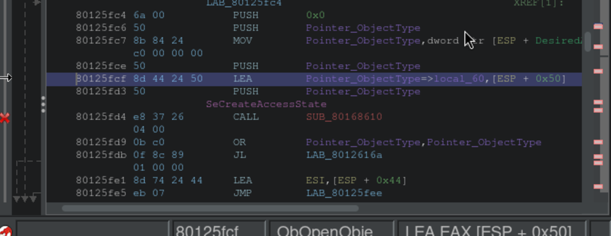

### 4. Captura de `ObjectAttributes`, `SecurityDescriptor`, y entrega a `ObpLookupObjectName`

Resto del cuerpo de la función, con las 4 llamadas restantes confirmadas por símbolo en `i386kd`:

```c
41  cVar3 = (char)((uint)local_8c >> 0x18);
42  iVar2 = func_0x80125cb6(AccessMode,ObjectAttributes,local_78,&local_80);
43  if (iVar2 < 0) goto joined_r0x80126054;
44  AccessState->SecurityDescriptor = (PSECURITY_DESCRIPTOR)0x0;
45  if (iStack_7c != 0) {
46    iVar2 = func_0x80176510(iStack_7c,AccessMode,1,0,&stack0xffffff64);
47    if (iVar2 < 0) goto joined_r0x80126054;
48    AccessState->SecurityDescriptor = unaff_ESI;
49  }
50  iVar2 = func_0x80125596(local_88,auStack_94,local_80,ObjectType,AccessMode,ObjectAttributes,
                             unaff_EDI,0,AccessState,&stack0xffffff5b,&stack0xffffff5c);
53  if (unaff_EDI != 0) {
54    func_0x801167f6(unaff_EDI);
55  }
```

#### `func_0x80125cb6` = `ObpCaptureObjectAttributes`

```
80126006  e8abfcffff   call   NT!_ObpCaptureObjectAttributes (80125cb6)
```

Mismo rol que `ObpCaptureObjectAttributes`/probing ya visto en `IoCreateFile`, aplicado acá al propio `OBJECT_ATTRIBUTES`: si `AccessMode == UserMode`, probea que la struct y el `UNICODE_STRING` de `ObjectName` sean memoria de usermode válida, copia los campos a un buffer de confianza en modo kernel (mitigación TOCTOU — evita que otro thread modifique la memoria de usermode entre la validación y el uso), copia el nombre a pool paginado, y valida `Attributes` contra `OBJ_VALID_ATTRIBUTES`. Sus salidas (`local_78`, `local_80`, y muy probablemente `iStack_7c` — contiguo en el stack, `ebp-0x7c` al lado de `ebp-0x78`) alimentan el resto de la función.

#### `func_0x80176510` = `SeCaptureSecurityDescriptor`

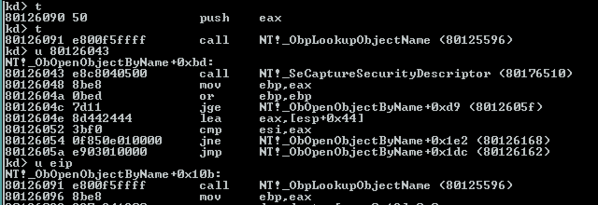

```
80126043  e8c8040500   call   NT!_SeCaptureSecurityDescriptor (80176510)
```

`iStack_7c` es candidato fuerte a ser el `SecurityDescriptor` capturado desde `ObjectAttributes` (por la salida contigua de `ObpCaptureObjectAttributes` y porque calza como 1er argumento de una función que "captura un security descriptor"). El `if (iStack_7c != 0)` solo entra si el caller pidió un `SecurityDescriptor` nuevo al abrir — en la corrida confirmada en vivo, `IoCreateFile` no pasó ninguno (`iStack_7c == 0`, confirmado con `db esp+3c`), así que la rama se saltea y `AccessState->SecurityDescriptor` queda en `NULL`.

#### `func_0x80125596` = `ObpLookupObjectName` — la función principal

```
80126091  e800f5ffff   call   NT!_ObpLookupObjectName (80125596)
```

Acá es donde termina yendo todo lo que `ObOpenObjectByName` preparó hasta ahora: `ObjectAttributes` capturado, `AccessState` armado, `SecurityDescriptor` capturado si correspondía. Es la resolución real del objeto por nombre en el namespace del Object Manager — el próximo nivel de la pila a reversear.

#### `func_0x801167f6` = `ExFreePool` — limpieza, no manejo de error

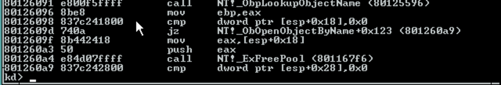

```
801260a4  e84d07ffff   call   NT!_ExFreePool (801167f6)
```

Libera `unaff_EDI` si se llegó a alocar algo (probablemente un buffer intermedio de `ObpCaptureObjectAttributes` o del propio lookup) — corre sin importar si `ObpLookupObjectName` tuvo éxito o falló, mismo patrón de epílogo ya visto en `IoCreateFile`.

#### Resumen del flujo completo

1. `NULL`-check básico de `ObjectAttributes` → `STATUS_INVALID_PARAMETER` si falta.
2. `SeCreateAccessState` → arma el `AccessState` (si no vino provisto desde afuera).
3. `ObpCaptureObjectAttributes` → captura/valida `ObjectAttributes` de verdad.
4. Si el caller pidió `SecurityDescriptor` → `SeCaptureSecurityDescriptor` lo captura.
5. `ObpLookupObjectName` → resolución real del objeto por nombre.
6. `ExFreePool` de limpieza.

### 5. Cierre — `ObpCreateHandle` y limpieza final

Último tramo de la función, con las 4 llamadas restantes confirmadas por símbolo en `i386kd`:

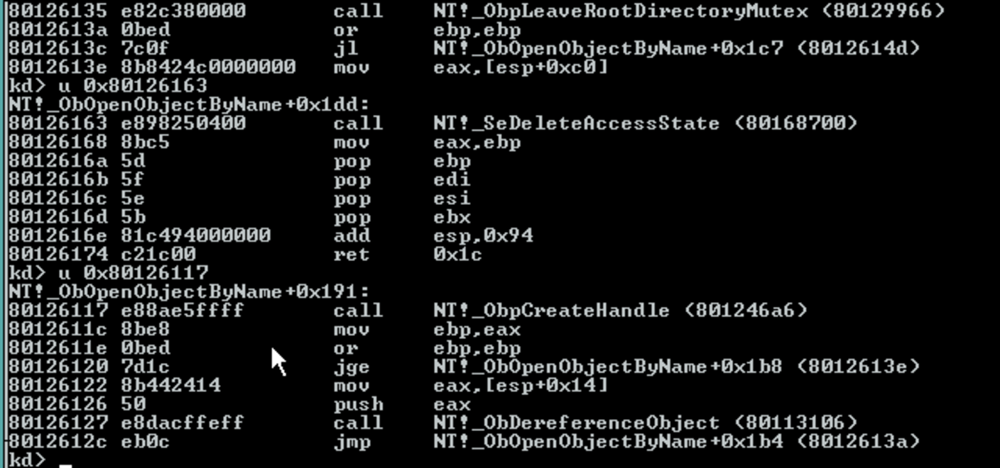

```
80126117  call   NT!_ObpCreateHandle (801246a6)
80126127  call   NT!_ObDereferenceObject (80113106)
80126135  call   NT!_ObpLeaveRootDirectoryMutex (80129966)
80126163  call   NT!_SeDeleteAccessState (80168700)
```

- **`ObpCreateHandle`** — el camino de éxito: convierte el objeto ya resuelto por `ObpLookupObjectName` en el `HANDLE` de salida que espera el caller original.
- **`ObDereferenceObject`** — camino de error después de `ObpCreateHandle`: si falla, decrementa el refcount del objeto ya referenciado por el lookup (patrón estándar de la API de NT).
- **`ObpLeaveRootDirectoryMutex`** — libera el mutex que protege el `RootDirectory` (`OBJECT_ATTRIBUTES`, Sección 1) mientras se resolvía el path, solo si se había tomado (`cVar3 != '\0'`).
- **`SeDeleteAccessState`** — contraparte de limpieza de `SeCreateAccessState` (Sección 3): libera el `ACCESS_STATE` armado en el stack si `ObOpenObjectByName` fue quien lo creó.


---

## Parte 4 — ObpLookupObjectName

Es la función a la que `ObOpenObjectByName` le entrega todo lo preparado: la resolución real del path en el namespace del Object Manager.

**Dirección:** `0x80125596` · **Tamaño:** `0x680` (1664 bytes) · **Volcado:** `code/dumps/obplookupobjectname.bin`

Es una función **FPO** (sin frame de `ebp`): el prólogo es `sub esp,0x30` + `push ebx/esi/edi/ebp`, y todo el direccionamiento va relativo a `esp`. Los 10 `ret 0x2c` del binario (`0x2c` = 44 bytes = 11 dwords) confirman **11 parámetros stdcall**, coincidiendo con los 11 argumentos del call site.

### Firma

```c
NTSTATUS ObpLookupObjectName(
    HANDLE                        RootDirectory,
    PUNICODE_STRING               ObjectName,
    ULONG                         Attributes,
    POBJECT_TYPE                  ObjectType,
    KPROCESSOR_MODE               AccessMode,
    PVOID                         ParseContext,
    PSECURITY_QUALITY_OF_SERVICE  SecurityQos,
    PVOID                         InsertObject,
    PACCESS_STATE                 AccessState,
    PBOOLEAN                      LookupContext,
    PVOID                        *FoundObject
);
```

Los nombres y tipos provienen de la literatura pública de NT (versiones posteriores), **no del DDK de 1994**. Lo que sí está confirmado contra este binario es el conteo de parámetros y, para varios de ellos, su valor y rol en vivo. El parámetro 10 está retipado a `PBOOLEAN` respecto de esa firma pública, por lo que se ve en el prólogo (ver más abajo).

### Los 11 parámetros, leídos en vivo

Parando en la entrada de la función, con la dirección de retorno en `[esp+0x00]`, cada parámetro *n* queda en `[esp + 4n]`:

```
kd> db esp+30
fbce9d30  96 60 12 80 00 00 00 00-84 9d ce fb 40 00 00 00
fbce9d40  00 00 00 00 01 f6 12 00-30 9e ce fb 00 00 00 00
fbce9d50  00 00 00 00 a4 9d ce fb-73 9d ce fb 74 9d ce fb
```

| # | Parámetro | Valor | Significado |
|---|---|---|---|
| — | *return address* | `80126096` | instrucción siguiente al `call` en `ObOpenObjectByName` |
| 1 | `RootDirectory` | `NULL` | sin ancla relativa → el path se resuelve desde la raíz `\` |
| 2 | `ObjectName` | `0xfbce9d84` | puntero a la `UNICODE_STRING` capturada |
| 3 | `Attributes` | `0x40` | `OBJ_CASE_INSENSITIVE` |
| 4 | `ObjectType` | `NULL` | no se fuerza tipo: resuelve a lo que el nombre encuentre |
| 5 | `AccessMode` | `0x0012f6`**`01`** | byte bajo `01` = `UserMode` |
| 6 | `ParseContext` | `0xfbce9e30` | el `OPEN_PACKET` armado por `IoCreateFile` |
| 7 | `SecurityQos` | `NULL` | sin QoS de impersonation |
| 8 | `InsertObject` | `NULL` | se busca un nombre existente, no se publica un objeto nuevo |
| 9 | `AccessState` | `0xfbce9da4` | el `ACCESS_STATE` armado por `SeCreateAccessState` |
| 10 | `LookupContext` | `0xfbce9d73` | salida, **1 byte** |
| 11 | `FoundObject` | `0xfbce9d74` | salida, dword |

Detalles que valen la pena:

- **`AccessMode` (5)** — `KPROCESSOR_MODE` es un `CCHAR` de 1 byte, pero se pushea como dword completo: los 3 bytes altos son restos del registro (acá `0x0012f6`, del stack de usermode del proceso llamante). Solo el byte bajo tiene significado.
- **`ParseContext` (6)** — apunta a memoria cuyo contenido arranca con `08 00 40 00`: `Type = 0x0008` (`IO_TYPE_OPEN_PACKET`) y `Size = 0x0040` (64 bytes). Confirmación en vivo del `OPEN_PACKET` que reconstruimos estáticamente en la Parte 2, Sección 11.
- **`AccessState` (9)** — la dirección coincide exactamente con la que calcula `lea esi,[esp+0x44]` en `ObOpenObjectByName` (`80125fe1`), justo antes de la llamada.
- **`LookupContext` (10) y `FoundObject` (11)** — las dos direcciones están a **1 byte** de distancia (`…73` y `…74`), lo que a primera vista parecería un solapamiento entre dos punteros de 4 bytes. El prólogo lo aclara (ver abajo).

### El prólogo: dos salidas de ancho distinto

Lo primero que hace la función, apenas termina de reservar el frame, es poner en cero los dos parámetros de salida — y lo hace con **anchos distintos**:

```asm
80125596  83 ec 30           sub   esp,0x30
80125599  53 56 57 55        push  ebx / esi / edi / ebp     ; corrimiento total: 0x40
8012559d  c7 44 24 20 ...    mov   DWORD PTR [esp+0x20],0x0
801255a5  8b 44 24 68        mov   eax,[esp+0x68]            ; param 10 — LookupContext
801255a9  c7 44 24 28 ...    mov   DWORD PTR [esp+0x28],0x20
801255b1  8b 4c 24 6c        mov   ecx,[esp+0x6c]            ; param 11 — FoundObject
801255b5  c6 00 00           mov   BYTE  PTR [eax],0x0       ; *LookupContext = 0   ← 1 byte
801255b8  c7 01 00 00 00 00  mov   DWORD PTR [ecx],0x0       ; *FoundObject   = 0   ← 4 bytes
```

Con el corrimiento de `0x40` del prólogo, el parámetro *n* queda en `[esp + 0x40 + 4n]`: `[esp+0x68]` es el 10 y `[esp+0x6c]` es el 11.

**Conclusión:** el parámetro 10 apunta a un valor de **un solo byte** (`BOOLEAN`), no a una estructura. Por eso las dos direcciones pueden estar pegadas sin pisarse: `…73` es el byte del param 10 y `…74` arranca el dword del param 11. Esto **descarta para NT 3.1** el `POBP_LOOKUP_CONTEXT` que figura en la firma de versiones posteriores.

La instrucción siguiente ya es el primer branch de la función:

```asm
801255ce  83 7c 24 44 00     cmp   DWORD PTR [esp+0x44],0x0  ; param 1 — RootDirectory
801255d3  0f 84 bd 02 00 00  je    +0x2bd
```

Compara `RootDirectory` contra `NULL`. En la corrida capturada es `NULL`, así que toma el salto: el camino de resolución desde la raíz del namespace.

### `UNICODE_STRING` — el descriptor del nombre

Confirmado en `NTDEF.H:620`:

```c
typedef struct _UNICODE_STRING {
    USHORT Length;         // +0x00  bytes usados (no caracteres)
    USHORT MaximumLength;  // +0x02  capacidad del buffer, en bytes
    PWSTR  Buffer;         // +0x04  puntero a los caracteres UTF-16
} UNICODE_STRING;
```

El puntero no es el texto: es este descriptor de 8 bytes. Leído en vivo:

```
kd> dd fbce9d84 L2
fbce9d84  003a0038 e11c4e88

kd> du e11c4e88
e11c4e88   "\DosDevices\C:\users\default"
```

- `Length = 0x0038` = 56 bytes = **28 caracteres** — los mismos 28 del path. Cierra exacto.
- `MaximumLength = 0x003a` = 58 bytes: los 56 más 2 para el terminador nulo.
- `Buffer = 0xe11c4e88` — rango de **paged pool**, coherente con que `ObpCaptureObjectAttributes` copia el nombre desde usermode a memoria del kernel.

### Qué es `\DosDevices`

El directorio del namespace donde viven los nombres al estilo DOS/Win32 (`C:`, `A:`, `COM1:`, `NUL`). No son dispositivos: son objetos **symbolic link** que apuntan al nombre NT real del device.

La resolución de `\DosDevices\C:\users\default` es entonces:

1. Arranca en `\` (porque `RootDirectory` es `NULL`).
2. Entra al directorio `\DosDevices`.
3. Encuentra el symbolic link `C:` y lo sigue hasta el device object del volumen.
4. Al llegar a un objeto cuyo tipo tiene `ParseProcedure` (el device del filesystem), le entrega el **resto del path** (`\users\default`) junto con el `ParseContext`.

Ese paso 4 es el mecanismo central: el Object Manager no sabe nada de archivos — camina el namespace hasta que un tipo de objeto reclama el resto del path.

*(En NT 3.1 `\DosDevices` es un directorio real. En versiones posteriores esto se reorganizó a `\??` y a `\Sessions\N\DosDevices\…` por sesión.)*

### Validación del nombre y el caso especial `"\"`

Dentro de la rama de `RootDirectory == NULL`, lo primero es validar que el nombre sea un path absoluto usable:

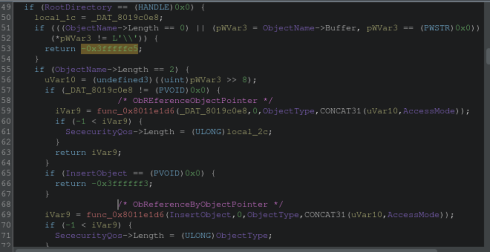

```asm
8012589f  mov  eax,[esp+0x48]        ; param 2 = ObjectName
801258a3  mov  cx,WORD PTR [eax]     ; cx = ObjectName->Length
801258a6  or   cx,cx
801258a9  je   80125c00              ; ① Length == 0        → error
801258af  mov  eax,[eax+0x4]         ; eax = ObjectName->Buffer
801258b2  or   eax,eax
801258b4  je   80125c00              ; ② Buffer == NULL     → error
801258ba  cmp  WORD PTR [eax],0x5c
801258be  jne  80125c00              ; ③ no arranca con '\' → error
801258c4  cmp  cx,0x2
801258c8  jne  80125712              ; ④ ¿el nombre es solo "\"?
```

Los tres errores van al mismo epílogo, que retorna `0xc000003b` (`STATUS_OBJECT_PATH_SYNTAX_BAD`). El chequeo ③ compara **un solo `WCHAR`** contra `0x5c` (`'\'`): exige path absoluto.

En la corrida capturada, con `ObjectName = "\DosDevices\C:\users\default"`, ninguno se dispara: `Length = 0x38`, `Buffer = 0xe11c4e88`, primer carácter `'\'`.

**El chequeo ④ y su rama no se recorren en este análisis.** `Length` está en *bytes* y cada carácter UTF-16 ocupa 2, así que `Length == 2` significa que el nombre es exactamente `"\"` — la raíz pelada. Ese caso especial no resuelve ningún path: toma el objeto que corresponda (el directorio raíz, o el que venga en `InsertObject`), lo pasa por `ObReferenceObjectByPointer` — documentada en `NTDDK.H:8882`, valida el tipo si se le da uno e **incrementa el refcount** — y lo devuelve en `FoundObject`. Si el nombre es `"\"` y no hay `InsertObject`, retorna `0xc000000d` (`STATUS_INVALID_PARAMETER`).

Nuestro nombre mide `0x38`, así que salta a `80125712`: el recorrido real del path componente por componente.

> Nota de lectura sobre la captura: las líneas `SececurityQos->Length = ...` son una **mala atribución del decompiler**. El assembly escribe en `*FoundObject` (`mov ecx,[esp+0x6c]` seguido de `mov [ecx],eax`), no en un campo de `SecurityQos`.

### El namespace por dentro: del directorio raíz al destino del symlink

`[esp+0x24]` guarda el **puntero** al objeto directorio raíz, no el objeto. La global se puede leer directo, sin depender de dónde esté parada la ejecución:

```
kd> dd 8019c0e8 L1     ; ObpRootDirectoryObject
```

Con ese puntero, el cuerpo del objeto es una **tabla de buckets de hash**: dwords, muchos en cero y el resto apuntando a paged pool (`e1xxxxxx`). Cada entrada no nula encabeza una cadena de objetos cuyo nombre hashea a ese bucket.

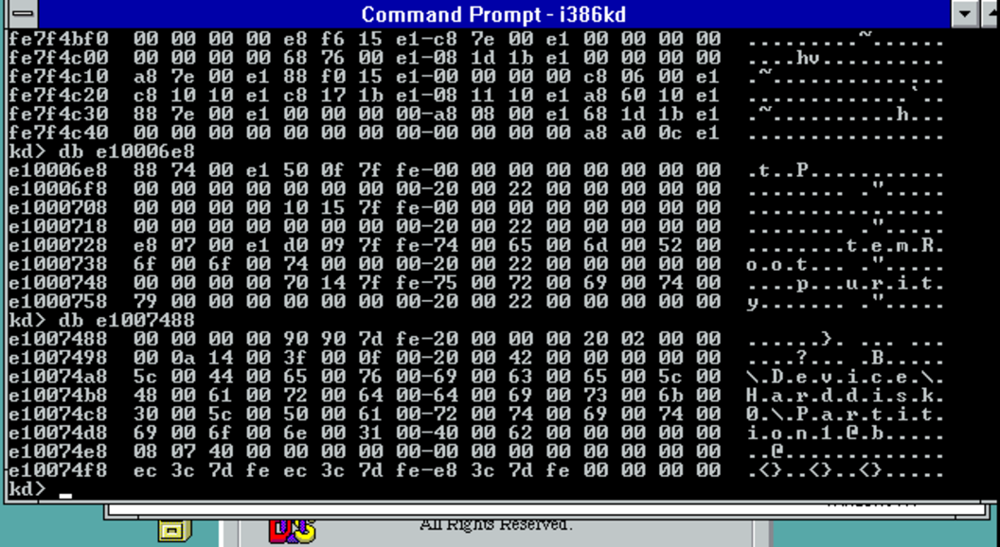

```
fe7f4bf0  00 00 00 00 e8 f6 15 e1-c8 7e 00 e1 00 00 00 00
fe7f4c00  00 00 00 00 68 76 00 e1-08 1d 1b e1 00 00 00 00
fe7f4c10  a8 7e 00 e1 88 f0 15 e1-00 00 00 00 c8 06 00 e1
fe7f4c20  c8 10 10 e1 c8 17 1b e1-08 11 10 e1 a8 60 10 e1
```

Siguiendo uno de esos punteros aparecen las entradas del directorio, con los nombres legibles en UTF-16 entremezclados con los punteros de la cadena:

```
e1000728  e8 07 00 e1 d0 09 7f fe-74 00 65 00 6d 00 52 00   ........t.e.m.R.
e1000738  6f 00 6f 00 74 00 00 00-20 00 22 00 00 00 00 00   o.o.t... ."....
e1000748  00 00 00 00 70 14 7f fe-75 00 72 00 69 00 74 00   ....p...u.r.i.t.
e1000758  79 00 00 00                                       y...
```

Se leen las colas de `SystemRoot` y de `Security` — objetos de primer nivel del namespace.

Y siguiendo otra entrada se llega al dato que cierra el círculo de `\DosDevices\C:`:

```
e10074a8  5c 00 44 00 65 00 76 00-69 00 63 00 65 00 5c 00   \.D.e.v.i.c.e.\.
e10074b8  48 00 61 00 72 00 64 00-64 00 69 00 73 00 6b 00   H.a.r.d.d.i.s.k.
e10074c8  30 00 5c 00 50 00 61 00-72 00 74 00 69 00 74 00   0.\.P.a.r.t.i.t.
e10074d8  69 00 6f 00 6e 00 31 00                           i.o.n.1.
```

**`\Device\Harddisk0\Partition1`** — el nombre NT real del volumen, o sea el destino al que apunta el symbolic link `C:`. Es el paso que describimos antes en teoría, ahora visto en memoria: el Object Manager entra a `\DosDevices`, encuentra el link `C:`, lo sigue hasta este device object, y de ahí en adelante el resto del path (`\users\default`) ya no es asunto suyo — se lo entrega al filesystem.

> Ni `OBJECT_HEADER` ni `OBJECT_DIRECTORY` están publicadas en el DDK de 1994: son internas del Object Manager. La lectura de "tabla de buckets" y de la cadena de entradas es **inferida** del patrón de los dumps, no confirmada contra un header.

### El bucle: un componente del path por vuelta

Con `RootDirectory` en `NULL`, el efecto neto de todo el bloque anterior es **uno solo**: dejar el directorio de partida (`ObpRootDirectoryObject`) en una variable local. El resto eran validaciones que, o abortan, o dejan pasar. De ahí el flujo salta a `80125712`, donde empieza el recorrido real.

Dos retipados en Ghidra hacen legible este tramo: los slots `[esp+0x30]` y `[esp+0x38]` son en realidad dos `UNICODE_STRING` locales (el compilador copia `Length`+`MaximumLength` con un solo `mov` de 32 bits, y sin el tipo correcto Ghidra lo muestra como una maraña de `CONCAT22`). Retipados, el bucle queda así:

```c
RemainingName.Length        = ObjectName->Length;
RemainingName.MaximumLength = ObjectName->MaximumLength;
RemainingName.Buffer        = ObjectName->Buffer;
while( true ) {
    ParentDirectory = CurrentDirectory;
    if (*RemainingName.Buffer == L'\\') {          // saltear la barra separadora
      RemainingName.Buffer = RemainingName.Buffer + 1;
      RemainingName.Length = RemainingName.Length - 2;
    }
    ComponentName.Buffer = RemainingName.Buffer;   // acá arranca el componente
    TotalLength = RemainingName.Length;
    RemainingLength = TotalLength;
    for (; (RemainingLength != 0 && (*RemainingName.Buffer != L'\\'));
           RemainingName.Buffer = RemainingName.Buffer + 1) {
      RemainingLength = RemainingName.Length - 2;  // avanzar hasta la próxima barra
      RemainingName.Length = RemainingLength;
    }
    ComponentName.Length = TotalLength - RemainingName.Length;
    if (ComponentName.Length == 0) {
      Status = 0xc0000033;                          // STATUS_OBJECT_NAME_INVALID
      goto LAB_80125bb7;
    }
```

Cada vuelta consume **un componente**: saltea la `\`, avanza hasta la siguiente, y calcula el largo por resta (`TotalLength` antes menos lo que quedó después). Si el componente sale vacío — dos barras seguidas, o una barra al final — corta con `STATUS_OBJECT_NAME_INVALID` (`0xc0000033`, `NTSTATUS.H:1458`).

Sobre `\DosDevices\C:\users\default`, la primera vuelta recorta `DosDevices`, la segunda `C:`, y así.

### `LookupContext` es un flag de mutex, no un contexto

Justo después, el bucle hace:

```c
    if (*_LookupContext == '\0') {
      *_LookupContext = '\x01';
      ObpEnterRootDirectoryMutex();
      CurrentDirectory = StartDirectory;
    }
```

Y en la salida está la operación simétrica:

```asm
80125a83  call NT!_ObpLeaveRootDirectoryMutex (80129966)
80125a88  mov  eax,[esp+0x68]      ; LookupContext
80125a8c  mov  BYTE PTR [eax],bl   ; = 0
```

Las dos funciones confirmadas por símbolo en `i386kd`: `ObpEnterRootDirectoryMutex` (`80129946`) y `ObpLeaveRootDirectoryMutex` (`80129966`) — contiguas en el binario, el patrón típico de un par enter/leave.

Esto le da el significado real al parámetro 10: **no es un "contexto de lookup" genérico, es el booleano *"tengo tomado el mutex del directorio raíz"***. Se pone en `1` al tomarlo y en `0` al soltarlo, y `ObOpenObjectByName` lo lee al volver para saber si le toca liberar. Encaja exactamente con el retipado a `PBOOLEAN` que ya habíamos deducido del ancho de las escrituras: un nombre más honesto para ese parámetro sería `RootMutexHeld`.
