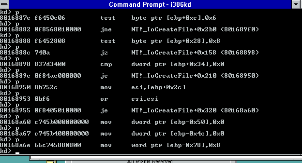

# Flujo de creación de procesos

Reversing de la cadena completa que dispara la apertura de un archivo desde `hello.exe`, aislando cada función una por una con `i386kd` y reconstruyéndolas en Ghidra: `NtOpenFile` → `IoCreateFile` → `ObOpenObjectByName`. Primer tramo del camino que termina, más adelante, en `NtCreateProcess`.

---

## Parte 1 — NtOpenFile: wrapper delgado sobre IoCreateFile

### Origen de los bytes

Dump crudo capturado desde el debugger kernel (`i386kd`):

```
kd> db 801690d0 L(80169110 - 801690d0)
801690d0  6a 00 6a 00 6a 00 6a 00-8b 44 24 28 6a 00 50 8b  j.j.j.j..D$(j.P.
801690e0  44 24 2c 6a 01 50 6a 00-8b 44 24 34 6a 00 50 8b  D$,j.Pj..D$4j.P.
801690f0  44 24 38 50 8b 44 24 38-50 8b 44 24 38 50 e8 3d  D$8P.D$8P.D$8P.=
80169100  f6 ff ff c2 18 00 8d 49-00 8d a4 24 00 00 00 00  .......I...$....
```

Guardado en `code/dumps/ntopenfile.bin` (bytes crudos) y `code/dumps/ntopenfile.log` (transcript del debugger). Verificado que ambos coinciden byte a byte.

### Desensamblado

| Dirección  | Bytes                  | Instrucción              |
|------------|-------------------------|---------------------------|
| 801690d0   | `6a 00`                | `push 0x0`                |
| 801690d2   | `6a 00`                | `push 0x0`                |
| 801690d4   | `6a 00`                | `push 0x0`                |
| 801690d6   | `6a 00`                | `push 0x0`                |
| 801690d8   | `8b 44 24 28`          | `mov eax, [esp+0x28]`     |
| 801690dc   | `6a 00`                | `push 0x0`                |
| 801690de   | `50`                   | `push eax`                |
| 801690df   | `8b 44 24 2c`          | `mov eax, [esp+0x2c]`     |
| 801690e3   | `6a 01`                | `push 0x1`                |
| 801690e5   | `50`                   | `push eax`                |
| 801690e6   | `6a 00`                | `push 0x0`                |
| 801690e8   | `8b 44 24 34`          | `mov eax, [esp+0x34]`     |
| 801690ec   | `6a 00`                | `push 0x0`                |
| 801690ee   | `50`                   | `push eax`                |
| 801690ef   | `8b 44 24 38`          | `mov eax, [esp+0x38]`     |
| 801690f3   | `50`                   | `push eax`                |
| 801690f4   | `8b 44 24 38`          | `mov eax, [esp+0x38]`     |
| 801690f8   | `50`                   | `push eax`                |
| 801690f9   | `8b 44 24 38`          | `mov eax, [esp+0x38]`     |
| 801690fd   | `50`                   | `push eax`                |
| 801690fe   | `e8 3d f6 ff ff`       | `call 0x80168740`         |
| 80169103   | `c2 18 00`             | `ret 0x18`                |
| 80169106   | `8d 49 00`              | `lea ecx,[ecx+0x0]` (padding) |
| 80169109   | `8d a4 24 00 00 00 00` | `lea esp,[esp+0x0]` (padding) |

**No hay prólogo** (`push ebp`/`mov ebp,esp` o `sub esp,N`): la función arranca directo con `push` y direcciona todo vía `[esp+N]`, sin frame pointer (build optimizado, FPO). Esto confirma que `801690d0` es el **primer byte** de `NtOpenFile` — en ese punto `esp` apunta a la dirección de retorno del caller.

Confirmado en vivo con `u` (desensamblado del propio debugger, coincide instrucción a instrucción con la tabla de arriba) y con un breakpoint en `NtOpenFile` que cae justo en el `call`:


En ambas capturas, `i386kd` resuelve `80168740` directo como `NT!_IoCreateFile` — confirma sin ambigüedad que la función **sí tiene símbolo público** (no hubo que inferir el nombre por firma/comportamiento).

### Reconstrucción del stack (orden de push, ESP relativo a la entrada de la función = `ESP0`)

`NtOpenFile(FileHandle, DesiredAccess, ObjectAttributes, IoStatusBlock, ShareAccess, OpenOptions)` — stdcall, 6 args:

| Offset desde ESP0 | Contenido en `[ESP0+N]` |
|---|---|
| +0x00 | dirección de retorno |
| +0x04 | arg1 `FileHandle` |
| +0x08 | arg2 `DesiredAccess` |
| +0x0C | arg3 `ObjectAttributes` |
| +0x10 | arg4 `IoStatusBlock` |
| +0x14 | arg5 `ShareAccess` |
| +0x18 | arg6 `OpenOptions` |

Siguiendo cada `push`/`mov` y recalculando el offset real contra `ESP0` (restando lo que ya se apiló), el stack que se arma para el `call 0x80168740` queda así, **en orden cronológico de push** (que en `stdcall` es el último parámetro del callee primero):

| # push | Valor | Origen | Parámetro de `IoCreateFile` (hipótesis) |
|---|---|---|---|
| 1 | `0x0` | inmediato | `Options` = 0 |
| 2 | `0x0` | inmediato | `ExtraCreateParameters` = NULL |
| 3 | `0x0` | inmediato | `CreateFileType` = `CreateFileTypeNone` (0) |
| 4 | `0x0` | inmediato | `EaLength` = 0 |
| 5 | `0x0` | inmediato | `EaBuffer` = NULL |
| 6 | `eax` = `[ESP0+0x18]` | **arg6 forward** | `CreateOptions` = `OpenOptions` |
| 7 | `0x1` | inmediato | `Disposition` = `FILE_OPEN` (1) |
| 8 | `eax` = `[ESP0+0x14]` | **arg5 forward** | `ShareAccess` = `ShareAccess` |
| 9 | `0x0` | inmediato | `FileAttributes` = 0 |
| 10 | `0x0` | inmediato | `AllocationSize` = NULL |
| 11 | `eax` = `[ESP0+0x10]` | **arg4 forward** | `IoStatusBlock` = `IoStatusBlock` |
| 12 | `eax` = `[ESP0+0x0C]` | **arg3 forward** | `ObjectAttributes` = `ObjectAttributes` |
| 13 | `eax` = `[ESP0+0x08]` | **arg2 forward** | `DesiredAccess` = `DesiredAccess` |
| 14 | `eax` = `[ESP0+0x04]` | **arg1 forward** | `FileHandle` = `FileHandle` |

**14 pushes = 56 bytes = 14 dwords**, exactamente la firma completa de `IoCreateFile`:

```c
NTSTATUS IoCreateFile(
    PHANDLE            FileHandle,        // forward arg1
    ACCESS_MASK        DesiredAccess,     // forward arg2
    POBJECT_ATTRIBUTES ObjectAttributes,  // forward arg3
    PIO_STATUS_BLOCK   IoStatusBlock,     // forward arg4
    PLARGE_INTEGER     AllocationSize,    // NULL
    ULONG              FileAttributes,    // 0
    ULONG              ShareAccess,       // forward arg5
    ULONG              Disposition,       // FILE_OPEN (1) — constante
    ULONG              CreateOptions,     // forward arg6 (OpenOptions)
    PVOID              EaBuffer,          // NULL
    ULONG              EaLength,          // 0
    CREATE_FILE_TYPE   CreateFileType,    // CreateFileTypeNone (0)
    PVOID              ExtraCreateParameters, // NULL
    ULONG              Options            // 0
);
```

### Conclusión de la Parte 1

- `NtOpenFile` es, tal cual se sospechaba, un **wrapper delgado sin lógica propia**: solo arma el stack de `IoCreateFile` completando los 8 parámetros que `NtOpenFile` no expone con constantes fijas (`FILE_OPEN`, `CreateFileTypeNone`, NULLs, ceros) y reenvía sus 6 argumentos tal cual.
- `ret 0x18` (24 = 6×4 bytes) confirma el cierre del frame de `NtOpenFile` con sus 6 parámetros stdcall — cierra el análisis del límite de la función.
- El padding final (`8d 49 00` / `8d a4 24 00000000`, formas de NOP multi-byte típicas de MSVC) alinea el próximo símbolo, patrón normal en builds de esta época.

---

## Parte 2 — IoCreateFile

**Función objetivo:** `NT!_IoCreateFile` en `ntoskrnl.exe` (build 3.10.5098.1)
**Dirección base:** `0x80168740`
**Herramientas:** Ghidra 11 + `i386kd` (kernel debugger NT 3.1)

### 1. Reconstrucción de tipos DDK auténticos para Ghidra

El primer obstáculo fue que Ghidra no conoce los tipos NT internos (`IO_STATUS_BLOCK`, `OBJECT_ATTRIBUTES`, `KPROCESSOR_MODE`, etc.). Los headers modernos de WDK no sirven porque las estructuras cambiaron. Necesitamos los headers originales de **NT DDK octubre 1994**.

#### Proceso para generar el `.gdt`

```bash
# 1. Crear symlinks en minúscula para los headers en mayúscula
for dir in ddk_extract/INC vc_extract/INCLUDE; do
  (cd "$dir" && for f in *; do
    lower=$(echo "$f" | tr '[:upper:]' '[:lower:]')
    [ "$f" != "$lower" ] && [ ! -e "$lower" ] && ln -s "$f" "$lower"
  done)
done

# 2. Preprocesar a un .h plano con gcc -E
gcc -E -xc -I ddk_extract/INC -I vc_extract/INCLUDE \
    -D_X86_ -Di386 ntddk_wrapper.c -o ntddk_flat.i

# 3. Limpiar líneas # y __declspec
sed -i -E \
  -e '/^# [0-9]/d' \
  -e '/^#pragma/d' \
  -e 's/__declspec\([^)]*\)//g' ntddk_flat.i

# Renombrar para que Ghidra lo acepte
cp ntddk_flat.i ntddk_flat.h
```

**`ntddk_wrapper.c`** incluye `<ntddk.h>` y agrega manualmente el prototipo de `IoCreateFile` (no está declarado en el DDK público de 1994, solo aparece en comentarios):

```c
NTSTATUS
IoCreateFile(
    OUT PHANDLE FileHandle,
    IN ACCESS_MASK DesiredAccess,
    IN POBJECT_ATTRIBUTES ObjectAttributes,
    OUT PIO_STATUS_BLOCK IoStatusBlock,
    IN PLARGE_INTEGER AllocationSize OPTIONAL,
    IN ULONG FileAttributes,
    IN ULONG ShareAccess,
    IN ULONG Disposition,
    IN ULONG CreateOptions,
    IN PVOID EaBuffer OPTIONAL,
    IN ULONG EaLength,
    IN CREATE_FILE_TYPE CreateFileType,
    IN PVOID ExtraCreateParameters OPTIONAL,
    IN ULONG Options
    );
```

Luego en Ghidra: **File → Parse C Source** → agregar `ntddk_flat.h` → **Parse to Program** → guarda como `nt31_ddk.gdt` en el Data Type Manager.

### 2. Firma de la función

`IoCreateFile` recibe **14 parámetros** (stdcall):

| # | Nombre | Tipo | Descripción |
|---|--------|------|-------------|
| 1 | `FileHandle` | `PHANDLE` | OUT — handle resultante |
| 2 | `DesiredAccess` | `ACCESS_MASK` | permisos solicitados |
| 3 | `ObjectAttributes` | `POBJECT_ATTRIBUTES` | nombre, atributos |
| 4 | `IoStatusBlock` | `PIO_STATUS_BLOCK` | OUT — resultado de la operación |
| 5 | `AllocationSize` | `PLARGE_INTEGER` | tamaño inicial (opcional) |
| 6 | `FileAttributes` | `ULONG` | atributos del archivo |
| 7 | `ShareAccess` | `ULONG` | compartición |
| 8 | `Disposition` | `ULONG` | CREATE/OPEN/TRUNCATE... |
| 9 | `CreateOptions` | `ULONG` | opciones del IRP |
| 10 | `EaBuffer` | `PVOID` | Extended Attributes (opcional) |
| 11 | `EaLength` | `ULONG` | longitud del EaBuffer |
| 12 | `CreateFileType` | `CREATE_FILE_TYPE` | None / NamedPipe / Mailslot |
| 13 | `ExtraCreateParameters` | `PVOID` | parámetros extra (opcional) |
| 14 | `Options` | `ULONG` | flags internos del kernel |

Pseudocódigo de Ghidra tras aplicar los tipos DDK:


### 3. Determinación de RequestorMode

Lo primero que hace la función es saber desde dónde fue llamada: ¿kernel o usermode?

```c
// Leer PreviousMode del KTHREAD actual
// FS:[0x124] = KPCR->PrcbData.CurrentThread (puntero al KTHREAD)
// KTHREAD+0x1d4 = PreviousMode (KPROCESSOR_MODE)
local_5 = *(char *)(unaff_FS_OFFSET[0x49] + 0x1d4);

// Flag IO_NO_PARAMETER_CHECKING (0x100):
// Si está presente, forzar KernelMode sin importar el caller real
if ((param_14 & 0x100) != 0) {
    local_5 = '\0';  // KernelMode = 0
}
```

- `KernelMode = 0` → el caller es de confianza, no se validan punteros
- `UserMode = 1` → el caller viene de ring 3, hay que validar todo

### 4. Estructura SEH — el frame de excepción MSVC

`IoCreateFile` usa `__try/__except` para proteger los accesos a memoria de usermode. El compilador MSVC para x86 implementa esto con una cadena de registros de excepción instalados en `FS:[0]`.

#### Layout del frame en el stack

El array `local_3c[4]` mapea el registro de excepción MSVC:

| Índice | Offset (ebp) | Campo | Valor |
|--------|-------------|-------|-------|
| `[0]` | `[ebp-0x38]` | `Next` | puntero al frame anterior en `FS:[0]` |
| `[1]` | `[ebp-0x34]` | `Handler` | `0x8010fdb8` = `_except_handler3` |
| `[2]` | `[ebp-0x30]` | `ScopeTable` | `0x8019db00` |
| `[3]` | `[ebp-0x2c]` | `TryLevel` | `-1` = inactivo, `0` = try#0, `1` = try#1 |

Ghidra muestra los valores hardcodeados antes de instalar el frame:


Assembly real capturado con `i386kd` mostrando cómo el compilador instala el frame en `FS:[0]`:


#### ScopeTable en `0x8019db00`

La ScopeTable describe los dos bloques `__try` independientes de la función:

```
kd> dd 8019db00 L6
8019db00: ffffffff 801688b8 801688c8
8019db0c: ffffffff 801689c6 801689d6
```

| TryLevel | PreviousTryLevel | Filter | HandlerBlock |
|----------|-----------------|--------|--------------|
| 0 | `0xffffffff` (-1) | `0x801688b8` | `0x801688c8` |
| 1 | `0xffffffff` (-1) | `0x801689c6` | `0x801689d6` |

- **`PreviousTryLevel = -1`** en ambos: son bloques independientes (no anidados).
- **Filter**: función que evalúa la excepción. Si devuelve `1` (`EXCEPTION_EXECUTE_HANDLER`) → ejecutar el handler.
- **HandlerBlock**: código del `__except { }` que se ejecuta si el filter lo aprueba.
- **TryLevel = 0** activa el try#0; **TryLevel = -1** indica que no hay try activo.

`_except_handler2` capturado en i386kd (el dispatcher de excepciones del runtime MSVC):


### 5. Flujo del else — rama UserMode

Cuando `RequestorMode == UserMode` (≠ `'\0'`), la función debe validar que todos los punteros que recibió de usermode son realmente escribibles antes de usarlos. Progresión completa del bloque en Ghidra — desde el primer pase (`func_0x...` sin renombrar) hasta las cuatro funciones ya identificadas (`ProbeAndWriteHandle`, `ProbeForWrite`, `RtlConvertLongToLargeInteger`, `ProbeForRead`) y el panel de Listing correlacionando la dirección real:


#### ¿Qué hace `Probe` realmente?

Es clave no confundir esto: **`Probe` no copia nada, solo valida** — es un gate de permisos que corre *antes* de tocar la memoria. Para cada rango `[Address, Address+Length)` verifica tres cosas:

1. **Que la dirección caiga en espacio de usermode** (por debajo de `0x80000000` en este build) y no en espacio del kernel. Esto es lo central: el kernel corre con acceso total a *toda* la memoria, kernel y usuario. Sin este chequeo, un proceso podría pasar una dirección del kernel disfrazada de "mi handle de salida", y el kernel — que tiene permiso de sobra — terminaría escribiendo ahí a pedido de usermode. `Probe` es lo que bloquea ese primitivo de escalada de privilegios.
2. **Alineación** — el `4` que se repite en cada llamada, acorde al tipo que se está validando.
3. **Que la página esté presente y con el permiso correcto** (legible para `ProbeForRead`, escribible para `ProbeForWrite`) — si no lo está, ahí es donde salta `STATUS_ACCESS_VIOLATION`, capturado por el `__try/__except` de la Sección 4. El frame SEH existe *específicamente* para esto.

La copia a una variable local (`local_24 = AllocationSize->field0`, o el `*FileHandle = 0` de más abajo) es un paso **separado**, que hace `IoCreateFile` recién después de que `Probe` dio el visto bueno — es la defensa contra TOCTOU (*time-of-check to time-of-use*): otro hilo del mismo proceso podría modificar o desmapear esa memoria microsegundos después de validada, así que el valor se copia a memoria del kernel (fuera del alcance de usermode) una sola vez y el resto de la función ya no vuelve a tocar el puntero original.

#### ProbeAndWriteHandle (`0x8010b760`)

Confirmado con `i386kd` — disassembly real:

```
NT!_ProbeAndWriteHandle:
8010b760  push    esi
8010b761  cmp byte ptr [NT!_MmCheckPteOnProbe], 0x0
8010b768  jz      +0x18
8010b76a  mov     esi, [esp+0x8]      ; esi = Address (FileHandle)
8010b76e  push    0x4                 ; alignment
8010b770  push    esi                 ; Address
8010b771  call    NT!_MmProbeForWrite ; valida escribibilidad
8010b776  jmp     +0x2f               ; → escribir el valor
```

Verifica que `MmCheckPteOnProbe` esté activo, llama a `MmProbeForWrite(Address, 4)` para garantizar que el puntero pertenece a usermode y es escribible, luego escribe `0` como valor inicial en `*FileHandle`.

#### ProbeForWrite (`0x80113306`)

Llamada como `ProbeForWrite(IoStatusBlock, 8, 4)`:
- Puntero: `IoStatusBlock`
- Longitud: `8` bytes (tamaño de `IO_STATUS_BLOCK`)
- Alineación: `4` bytes

Valida que `IoStatusBlock` está completamente en espacio de usuario y es escribible.

**Por qué acá es solo `ProbeForWrite` y no `ProbeAndWrite` como con `FileHandle`:** `IoStatusBlock` es el resultado *final* de la operación (`Status`/`Information`) — algo que en este punto de la función todavía no existe. El valor real recién se conoce mucho más adelante, adentro de `IopCreateFile`, después de que el filesystem driver completa el IRP (potencialmente de forma asíncrona). El trabajo se divide en dos: **validar ya** (fail-fast — mejor descubrir un puntero inválido acá, con un error simple, que mil líneas después en medio de una IRP ya en curso) y **escribir después**, cuando el resultado real esté disponible.

#### RtlConvertLongToLargeInteger (`0x80160084`)

Cuando `AllocationSize == NULL`, la función crea un `LARGE_INTEGER` de valor cero para usar como tamaño por defecto. `RtlConvertLongToLargeInteger(0)` extiende el entero `0` a 64 bits.

Confirmado en vivo con un breakpoint en `IoCreateFile+0x84`: el `jz` salta directo al `push 0x0` + `call NT!_RtlConvertLongToLargeInteger`, saltándose por completo la rama de `ProbeForRead` — la prueba de que cuando `AllocationSize` es `NULL` nunca se toca memoria de usermode para este parámetro:


#### ProbeForRead (`0x801136c6`)

Rama `else` — cuando el caller sí mandó un `AllocationSize` real (`!= NULL`), visible en la captura de arriba: `ProbeForRead(AllocationSize, 8, 4)` seguido de `local_24 = AllocationSize->field0`. Mismo patrón que `ProbeForWrite`, pero para **lectura**: valida que los 8 bytes de `AllocationSize` son legibles desde usermode antes de desreferenciarlos. Recién con el puntero validado, `local_24 = AllocationSize->field0` copia el valor a la variable local del kernel — la misma defensa TOCTOU explicada arriba: se lee una sola vez, apenas validado, y el resto de la función ya no vuelve a tocar `AllocationSize` directamente.

### 6. Flujo completo de IoCreateFile

```
IoCreateFile(FileHandle, DesiredAccess, ObjectAttributes, IoStatusBlock,
             AllocationSize, FileAttributes, ShareAccess, Disposition,
             CreateOptions, EaBuffer, EaLength, CreateFileType,
             ExtraCreateParameters, Options)
│
├─ 1. Leer KTHREAD->PreviousMode desde FS:[0x124]+0x1d4
│     Si Options & 0x100 (IO_NO_PARAMETER_CHECKING) → forzar KernelMode
│
├─ 2. Si KernelMode → sin validaciones (el kernel se fía de sí mismo)
│
└─ 3. Si UserMode:
      ├─ Abrir try#0 (TryLevel = 0)
      ├─ ProbeAndWriteHandle(FileHandle, 0)     → pre-zerear + validar
      ├─ ProbeForWrite(IoStatusBlock, 8, 4)     → validar IoStatusBlock
      ├─ Si AllocationSize == NULL → RtlConvertLongToLargeInteger(0)
      │  Si no  → ProbeForRead(AllocationSize, 8, 4) + copiar a local_24
      ├─ Validación gigante de FileAttributes/ShareAccess/Disposition/CreateOptions/
      │  DesiredAccess → si algo no cierra, STATUS_INVALID_PARAMETER (Sección 8)
      ├─ Si CreateFileType != None → validar NamedPipe/Mailslot (Sección 9)
      ├─ Si EaBuffer != NULL:
      │   └─ Abrir try#1 (TryLevel = 1)
      │       ProbeForRead(EaBuffer, EaLength) + copiar al kernel heap
      └─ Llamar IopCreateFile(...)  ← el trabajo real
```

**Idea central:** `IoCreateFile` es un guardia de seguridad. Valida que los punteros de usermode son legítimos antes de pasarlos al motor real (`IopCreateFile`), todo protegido con `__try/__except` para capturar cualquier acceso inválido.

### 7. Flags internos (parámetro `Options`)

Definidos en `NTDDK.H` (DDK octubre 1994):

```c
#define IO_FORCE_ACCESS_CHECK    0x0001
#define IO_OPEN_PAGING_FILE      0x0002
#define IO_OPEN_TARGET_DIRECTORY 0x0004
// 0x0100 = IO_NO_PARAMETER_CHECKING (interno, no declarado públicamente)
```

El flag `0x100` es el único que afecta el flujo de `IoCreateFile` directamente: fuerza `KernelMode` saltando todas las validaciones de usermode.

### 8. Validación de parámetros — el `if` gigante

Después de resolver `AllocationSize` (Sección 5), y antes de tocar `EaBuffer` o llamar a `IopCreateFile`, la función corre un único `if` con toda la validación cruzada de `FileAttributes`, `ShareAccess`, `Disposition`, `CreateOptions` y `DesiredAccess`. Si cualquier condición da cierto, corta con `STATUS_INVALID_PARAMETER`:


`0xc000000d` está confirmado en `NTSTATUS.H` del DDK:

```c
#define STATUS_INVALID_PARAMETER         ((NTSTATUS)0xC000000DL)
```

`LAB_80168c55` es el punto de salida de error común de la función — cierra el `__try` y retorna sin haber llamado nunca a `IopCreateFile`.

#### Los tres niveles de validación

La expresión mezcla tres tipos de chequeo distintos:

1. **Validez de un solo campo** — ¿el valor, aislado, es basura?
2. **Mutua exclusión dentro de un mismo campo** — ¿pidió dos cosas contradictorias en el mismo parámetro?
3. **Coherencia entre campos** — ¿lo que pidió en un parámetro tiene sentido dado lo que pidió en otro?

#### 1. Validez individual de cada campo

**`(FileAttributes & 0xfffff848) != 0`** — complemento de `0x7B7`. Confirmado contra `winnt.h`, calza exacto con los 9 atributos válidos del DDK de 1994:

```c
#define FILE_ATTRIBUTE_READONLY         0x00000001
#define FILE_ATTRIBUTE_HIDDEN           0x00000002
#define FILE_ATTRIBUTE_SYSTEM           0x00000004
#define FILE_ATTRIBUTE_DIRECTORY        0x00000010
#define FILE_ATTRIBUTE_ARCHIVE          0x00000020
#define FILE_ATTRIBUTE_NORMAL           0x00000080
#define FILE_ATTRIBUTE_TEMPORARY        0x00000100
#define FILE_ATTRIBUTE_ATOMIC_WRITE     0x00000200
#define FILE_ATTRIBUTE_XACTION_WRITE    0x00000400
```

`ATOMIC_WRITE`/`XACTION_WRITE` son vestigios del diseño original de archivos transaccionales de NT, abandonado casi por completo — sobrevivieron como flags aceptados sin efecto real.

**`(ShareAccess & 0xfffffff8) != 0`** — complemento de `0x7`. El header solo documenta dos flags públicos:

```c
#define FILE_SHARE_READ                 0x00000001
#define FILE_SHARE_WRITE                0x00000002
```

pero la máscara del kernel ya deja pasar un tercer bit (`0x4`) sin nombre público en este DDK — casi con certeza el precursor de lo que en versiones posteriores de NT se documentó como `FILE_SHARE_DELETE`.

**`(5 < Disposition)`** — a diferencia de los anteriores no es una máscara de bits, es un rango: `Disposition` es un valor enumerado secuencial (`0`-`5`), y el header confirma el límite con su propia constante:

```c
#define FILE_MAXIMUM_DISPOSITION        0x00000005
```

**`(CreateOptions & 0xffff8000) != 0`** — complemento exacto de una constante que el propio DDK ya nombra:

```c
#define FILE_VALID_OPTION_FLAGS          0x00007FFF
```

#### 2. Mutua exclusión dentro de un mismo campo

**`(CreateOptions & 0x10) != 0 && (CreateOptions & 0x20) != 0`** — `FILE_SYNCHRONOUS_IO_ALERT` y `FILE_SYNCHRONOUS_IO_NONALERT` no pueden estar los dos prendidos: son dos modos alternativos del mismo flag `Alertable` que `KeWaitForSingleObject` recibe internamente — alertable (la espera se puede interrumpir con una APC en cola) vs. no-alertable (ignora APCs pendientes hasta que termine la I/O). Pedir los dos es una contradicción lógica, no una combinación válida.

#### 3. Coherencia entre campos

**`(CreateOptions & 0x30) != 0 && (DesiredAccess & 0x100000) == 0`** — pidió I/O síncrono (`0x30` = `SYNC_ALERT | SYNC_NONALERT`) pero no pidió `SYNCHRONIZE` (`0x100000`) al abrir el handle. Un file object se puede esperar como cualquier otro kernel object (evento, mutex) — para que el I/O Manager señalice y el caller pueda bloquearse hasta que termine, el handle necesita el derecho `SYNCHRONIZE`, igual que necesitarías ese derecho para un `WaitForSingleObject`.

**`(CreateOptions & 0x1000) != 0 && (DesiredAccess & 0x10000) == 0`** — pidió `FILE_DELETE_ON_CLOSE` (`0x1000`) pero no pidió `DELETE` (`0x10000`) en `DesiredAccess`. Es la regla documentada de la API: no podés marcar un archivo para que se borre solo al cerrar el handle si nunca pediste permiso de borrado al abrirlo — de lo contrario sería una forma de esquivar el chequeo de autorización normal de un delete.

**`(CreateOptions & 8) != 0 && (DesiredAccess & 4) != 0`** — `FILE_NO_INTERMEDIATE_BUFFERING` (I/O sin caché, todo alineado a sector) junto con `FILE_APPEND_DATA` (el kernel decide automáticamente que cada write cae al EOF actual). *(Hipótesis, no confirmada mirando `IopCreateFile`)*: el EOF de un archivo no tiene por qué caer en un límite de sector, así que delegarle al kernel la posición del write y a la vez exigir alineación estricta de sector son responsabilidades que se contradicen.

#### Bloque especial: apertura de directorios

**`(CreateOptions & 1) != 0`** (`FILE_DIRECTORY_FILE`) actúa como *gate*, no como negación — activa un sub-bloque de reglas que solo aplican cuando se pide explícitamente un directorio:

**`(CreateOptions & 0xffff9fcc) != 0`** — complemento de `0x6033`, que son exactamente estos seis flags:

```
0x0001  FILE_DIRECTORY_FILE
0x0002  FILE_WRITE_THROUGH
0x0010  FILE_SYNCHRONOUS_IO_ALERT
0x0020  FILE_SYNCHRONOUS_IO_NONALERT
0x2000  FILE_OPEN_BY_FILE_ID
0x4000  FILE_OPEN_FOR_BACKUP_INTENT
```

Cualquier otro bit de `CreateOptions` (buffering, oplocks, EAs — todo lo que aplica a *contenido* de archivo, no a un directorio) es inválido acá. De yapa, esto atrapa sin chequeo aparte la contradicción `FILE_DIRECTORY_FILE` + `FILE_NON_DIRECTORY_FILE` (`0x40`), porque `0x40` tampoco está en el set válido.

**`Disposition != 2 && Disposition != 1 && Disposition != 3`** — para un directorio solo se permiten `FILE_OPEN`, `FILE_CREATE`, `FILE_OPEN_IF`. Los tres rechazados (`FILE_SUPERSEDE`, `FILE_OVERWRITE`, `FILE_OVERWRITE_IF`) implican reemplazar/truncar contenido — algo que no existe para un directorio.

**`(DesiredAccess & 6) != 0`** — `FILE_ADD_FILE`/`FILE_ADD_SUBDIRECTORY` (mismos bits que `FILE_WRITE_DATA`/`FILE_APPEND_DATA`, pero renombrados para un directorio según `winnt.h`). *(Hipótesis, no confirmada)*: probablemente estos derechos se evalúan contra el ACL del directorio cuando alguien más tarde crea algo adentro (abriendo el path hijo), no algo que tenga sentido pedir directamente al abrir el handle del directorio en sí.

### 9. Validación específica por `CreateFileType` (NamedPipe / Mailslot)

Un segundo bloque de validación, estructuralmente separado del `if` gigante de la Sección 8, cubre los dos tipos especiales de `CreateFileType` (recordar el enum de la Sección 2 — `CreateFileTypeNone = 0`, `CreateFileTypeNamedPipe = 1`, `CreateFileTypeMailslot = 2`, confirmado en `NTDDK.H`):


El `if (CreateFileType != CreateFileTypeNone)` de afuera es un *guard clause*, no una regla de negocio — a diferencia de los bitmasks de la Sección 8, `CreateFileType` es un enum de un solo valor, así que "no es None" y "es NamedPipe" no son dos condiciones independientes: si es `NamedPipe`, automáticamente ya es distinto de `None`. El gate solo existe para saltear todo el bloque en el caso común (abrir un archivo normal).

#### Bloque `NamedPipe`

Primero, `ExtraCreateParameters == NULL` → inválido (un pipe necesita esos parámetros extra para poder crearse). Después, un segundo `if` valida:

- **Tres campos dentro de la estructura apuntada por `ExtraCreateParameters`** (offsets `0x0`, `0x4`, `0x8`), cada uno rechazado si vale más de `1`. No están en el DDK público de 1994 (es un detalle interno compartido entre el I/O Manager y `NPFS.SYS`), pero por documentación de NT bien conocida — *sin confirmar contra un header de esta build* — corresponden a:
  ```c
  typedef struct _NAMED_PIPE_CREATE_PARAMETERS {
      ULONG NamedPipeType;    // offset 0x0 — 0 = byte stream, 1 = message
      ULONG ReadMode;         // offset 0x4 — 0 = byte,       1 = message
      ULONG CompletionMode;   // offset 0x8 — 0 = queue,      1 = complete
      ...
  } NAMED_PIPE_CREATE_PARAMETERS;
  ```
  Los tres son enums booleanos disfrazados de `ULONG` — mismo patrón "Tipo 1" de la Sección 8 (validez de un campo aislado), aplicado a campos de una estructura en vez de a un parámetro directo.
- **`ShareAccess & 4`** — el mismo bit sin nombre público de la Sección 8 (precursor de `FILE_SHARE_DELETE`): un pipe no tiene semántica de "borrado" tipo archivo, se rechaza.
- **`Disposition == 0`** (`FILE_SUPERSEDE`) combinado con `3 < Disposition` más abajo: el único rango que sobrevive es `1`-`3` (`FILE_OPEN`/`FILE_CREATE`/`FILE_OPEN_IF`) — mismo trío que quedó habilitado para directorios, porque un pipe tampoco tiene contenido para reemplazar.
- **`CreateOptions & 0xffffffcd`** — complemento de `0x32`: solo `FILE_WRITE_THROUGH`, `FILE_SYNCHRONOUS_IO_ALERT`, `FILE_SYNCHRONOUS_IO_NONALERT` son válidos, un set todavía más chico que el de directorios.

#### Bloque `Mailslot`

Misma estructura (`ExtraCreateParameters == NULL` → inválido primero), pero sin el chequeo de campos internos — la estructura de mailslot no tiene esos tres enums booleanos. El segundo `if` valida:

- **`ShareAccess & 4`** — mismo motivo que `NamedPipe`.
- **`ShareAccess & 0xfffffffd) == 0`** — la primera vez que aparece `== 0` en vez de `!= 0`: la máscara `0xfffffffd` (complemento de `0x2`, `FILE_SHARE_WRITE`) agarra *todos los demás bits* de `ShareAccess`. Que el resultado sea `0` significa que no hay ningún bit prendido salvo, como mucho, `0x2` — en la práctica, exige que `FILE_SHARE_READ` (`0x1`) esté presente. *(Hipótesis, no confirmada)*: probablemente porque los clientes que le escriben mensajes al mailslot necesitan su propio handle de lectura simultáneo.
- **`Disposition != 2`** — a diferencia de `NamedPipe`, un mailslot **solo** admite `FILE_CREATE`. No existe "conectarse" a un mailslot existente por esta vía — eso se hace abriendo el path como archivo común (`CreateFileTypeNone`).
- **`CreateOptions & 0xffffffcd`** — mismo set válido que `NamedPipe`.

### 10. Bloque `EaBuffer` — try#1 (última parte de la rama UserMode)

Última pieza de la rama `else` (`UserMode`) que arrancó en la Sección 5 — el segundo bloque `__try` independiente de la ScopeTable (Sección 4, `TryLevel = 1`), justo antes de armar los parámetros para el motor real de creación:


**Qué es `EaBuffer`:** parámetro 10, `PVOID` opcional a una cadena de **Extended Attributes** (EAs) — un resabio directo del **HPFS de OS/2**, heredado por compatibilidad con el subsistema OS/2 de NT. Cada EA es una `FILE_FULL_EA_INFORMATION` (confirmado en `NTDDK.H`: `NextEntryOffset`, `Flags`, `EaNameLength`, `EaValueLength`, `EaName[]` seguido del valor crudo), encadenadas entre sí. `EaLength` (parámetro 11) es el tamaño total en bytes de la cadena.

**El gate:** `if (EaBuffer == NULL || EaLength == 0)` → caso vacío, `local_54 = NULL` y `local_50 = 0` (el par "buffer de EA ya copiado al kernel + su tamaño" que la función arma acá, sea vacío o real, y que viaja hacia el motor de creación en vez del `EaBuffer` original de usermode). Nota: la etiqueta `LAB_80168a60` cae justo dentro de este caso vacío — hay otro punto de la función, no visto en esta captura, que salta directo acá sin pasar por el chequeo.

**Rama `else` (EA real, no reverseada por ahora):** cuando sí hay EAs, el bloque llama `ProbeForRead(EaBuffer, EaLength, 4)` (misma dirección `0x801136c6` que ya identificamos), reserva un buffer del kernel, copia el contenido a mano (DWORD a DWORD y después byte a byte), y valida el formato de la cadena con lo que parece ser `IoCheckEaBufferValidity` (firma `buffer, length, &ErrorOffset` — coincide con la función real documentada de NT). Queda pendiente de reversear en detalle — es la rama de compatibilidad con OS/2, no el camino común.

**Confirmación en vivo con `i386kd`:** con un breakpoint en `IoCreateFile` (`bp 80168740`) disparado desde `hello.exe`, `dd esp L4` mostró la dirección de retorno como `80169103` — coincide *exacto* con el valor calculado a mano en la Parte 1 (`801690fe` + 5 bytes de `call` = `80169103`), confirmando en vivo que este `IoCreateFile` fue invocado desde `NtOpenFile`. Siguiendo la ejecución hasta la zona del `if` gigante y el gate de `CreateFileType`, el disassembly confirmó en vivo los offsets exactos de varios parámetros contra el frame (`ebp+0x8 + 4×(n-1)`), validando la aritmética que veníamos usando solo por cálculo:

| Parámetro | Offset confirmado |
|---|---|
| `DesiredAccess` (2) | `[ebp+0xC]` |
| `Disposition` (8) | `[ebp+0x24]` |
| `CreateOptions` (9) | `[ebp+0x28]` |
| `EaBuffer` (10) | `[ebp+0x2C]` |
| `CreateFileType` (12) | `[ebp+0x34]` |

En esta corrida en particular, `hello.exe` no usa Extended Attributes: `EaBuffer` llegó `NULL`, confirmando en vivo que se toma la rama vacía del gate — nunca se ejecuta el `else`:

```
80168953  0bf6          or  esi,esi
80168955  0f8405010000  je  NT!_IoCreateFile+0x320 (80168a60)
80168a60  c745b0000000    mov dword ptr [ebp-0x50],0x0
80168a67  c745b400000000  mov dword ptr [ebp-0x4c],0x0
```

Con `esi` (`EaBuffer`) en `NULL`, el `je` salta directo a `80168a60` — exactamente la dirección de `LAB_80168a60` ya identificada en Ghidra. El `else` completo (`ProbeForRead`, la reserva y copia manual, la validación tipo `IoCheckEaBufferValidity`) queda salteado por completo; las dos instrucciones en el destino son el zero-init real detrás de `local_54 = NULL` / la longitud en `0`.



### 11. Armado del `OPEN_PACKET` y llamada a `ObOpenObjectByName`

Con todas las validaciones pasadas, `IoCreateFile` arma la estructura que finalmente cruza la frontera hacia el Object Manager:


#### El `OPEN_PACKET`

`local_7c` en adelante no son variables sueltas — es una sola estructura armada en el stack y pasada por referencia (`&local_7c`) al final. La evidencia: se escriben todas en secuencia justo antes de una única llamada que recibe esa dirección, y ninguna se vuelve a leer después dentro de la misma función — el "lector" real es la función a la que se le pasa el puntero, no `IoCreateFile`.

`local_7c = 8` confirma qué estructura es exactamente — coincide con una constante real de `NTDDK.H`:

```c
#define IO_TYPE_OPEN_PACKET             0x00000008
```

Es un **`OPEN_PACKET`**: la estructura interna que el I/O Manager arma para pasarle al Object Manager genérico toda la información específica de creación de archivos. `local_7a = 0x40` acompaña a `Type` como el campo `Size` (mismo patrón de header `Type`+`Size` que usan otras estructuras visibles del Object Manager). Entre los campos que se ven armados: `local_5c = Disposition << 0x18 | CreateOptions` — empaqueta los dos en un solo `ULONG` (`Disposition` cabe en el byte alto porque nunca pasa de `5`, `CreateOptions` nunca pasa de 15 bits válidos según `FILE_VALID_OPTION_FLAGS` — Sección 8 — así que no hay superposición posible), además de `FileAttributes`, `ShareAccess`, `Options`, `CreateFileType` y `ExtraCreateParameters` copiados directo.

**Por qué se arman acá y no se vuelven a usar:** el `OPEN_PACKET` es el `ParseContext` — un `PVOID` genérico que el Object Manager no interpreta, solo arrastra sin tocar hasta la rutina de parseo del tipo de objeto correspondiente (acá, la del filesystem). El campo `Type` es lo que le permite a esa rutina, del otro lado, confirmar en runtime que lo que recibió es realmente un `OPEN_PACKET` antes de confiar en el resto de sus campos — el tamaño/offsets de cada campo los conoce en tiempo de compilación (comparte la definición de la estructura con `IoCreateFile`, no depende de leerlo de la memoria).

#### Los dos `ExInterlockedAddUlong` — contabilidad, no sincronización nueva

Justo antes de la llamada final, dos incrementos atómicos de contadores de estadísticas de I/O — confirmado con `i386kd` (símbolos reales vía `ln`):


```c
ULONG
ExInterlockedAddUlong (
    IN PULONG      Addend,
    IN ULONG       Increment,
    IN PKSPIN_LOCK Lock
    );
```

Primitivo de sincronización de bajo nivel: suma `Increment` a `*Addend` de forma atómica, tomando el spinlock `Lock` — evita que dos CPUs pisen el mismo contador en un kernel SMP.

- **Primera llamada** — `Addend`/`Lock` calculados desde `FS:[0x124]` (el `KTHREAD` actual, Sección 3) → `*(KTHREAD+0x150)` (casi con certeza `ApcState.Process`, puntero al `EPROCESS`) → `+0x100`/`+0xc0`. Sin header público que confirme los nombres exactos (`EPROCESS`/`KTHREAD` son opacos en este DDK), pero es un contador **por proceso**.
- **Segunda llamada** — direcciones fijas, confirmadas con `ln`:
  ```
  kd> ln 80198270
  (80198270)   NT!_IoOtherOperationCount
  kd> ln 801a5140
  (801a5140)   NT!_IoStatisticsLock
  ```
  `IoOtherOperationCount` es un contador **global** real del I/O Manager — la familia `IoReadOperationCount`/`IoWriteOperationCount`/`IoOtherOperationCount` cuenta operaciones de I/O por tipo; crear/abrir un archivo cae en "otra". Mismo offset relativo (`+0x100`/`+0xc0`) que la llamada por-proceso — mismo layout de contadores, una copia global y una por proceso.

Ninguna de las dos llamadas crea un mecanismo de sincronización nuevo — el spinlock ya existe de antes; esto solo lo usa para anotar, de forma segura, que acá pasó una operación de I/O de tipo "otra".

#### La llamada a `ObOpenObjectByName`

```c
STATUS_ERR = func_0x80125f86(ObjectAttributes, 0, RequestorMode, 0, DesiredAccess, &local_7c, &local_18);
```

7 argumentos, match exacto con la firma real (no pública, pero bien documentada en la literatura de NT internals) de `ObOpenObjectByName`:

```c
NTSTATUS ObOpenObjectByName(
    POBJECT_ATTRIBUTES ObjectAttributes,
    POBJECT_TYPE       ObjectType,       // 0 — se resuelve por nombre, no se fuerza
    KPROCESSOR_MODE     AccessMode,      // RequestorMode
    PACCESS_STATE       AccessState,     // 0 — sin AccessState pre-armado
    ACCESS_MASK         DesiredAccess,
    PVOID                ParseContext,   // &local_7c — el OPEN_PACKET
    PHANDLE              Handle          // &local_18 — handle de salida
);
```

Confirmado en vivo con `i386kd` — el debugger resuelve el símbolo directo, y el orden de `push` (inverso a la declaración en `stdcall`) confirma cada argumento contra offsets ya conocidos del propio frame de `IoCreateFile`:

```
80168b0f  mov eax,[ebp+0xc]    ; push eax   → DesiredAccess (mismo offset que el param. 2 de IoCreateFile)
80168b15  mov al,[ebp-0x1]     ; push eax   → RequestorMode (AccessMode) — offset real confirmado
80168b1b  mov eax,[ebp+0x10]   ; push eax   → ObjectAttributes (mismo offset que el param. 3 de IoCreateFile)
80168b1f  call NT!_ObOpenObjectByName (80125f86)
```


Es el punto donde `IoCreateFile` entrega el control al Object Manager genérico — `ObpLookupObjectName` (ver Parte 3) resuelve el path, y cuando llega al filesystem driver, el `ParseContext` (`OPEN_PACKET`) es lo que le dice qué hacer específicamente con el archivo.

Al final del bloque, si se había reservado un buffer de EA en la Sección 10 (`local_54 != NULL`), se libera con `func_0x801167f6(local_54)` — pendiente de confirmar el nombre (candidato natural: `ExFreePool`) y de entender exactamente en qué punto se consumió ese buffer antes de liberarlo.

### 12. Epílogo — procesar el resultado y desarmar el frame SEH

Última parte de la función: qué hace `IoCreateFile` con lo que devolvió `ObOpenObjectByName`, y cómo cierra el `__try/__except` de la Sección 4 antes de retornar.


```c
if (local_54 != (undefined4 *)0x0) {
    func_0x801167f6(local_54);
}
bVar3 = local_6c != -0x4155fdaf;
if (-1 < (int)STATUS_ERR) {
    if (!bVar3) {
        *(uint *)(local_78 + 0x2c) = *(uint *)(local_78 + 0x2c) | 0x40000;
        *FileHandle = local_18;
        IoStatusBlock->Information = local_70;
        IoStatusBlock->Status = local_74;
        STATUS_ERR = local_74;
        goto Exit_IoCreateFile;
    }
    if (-1 < (int)STATUS_ERR) {
        func_0x80121d66(local_18);
        STATUS_ERR = 0xc0000024;
    }
}
if ((int)local_74 < 0) {
    STATUS_ERR = local_74;
    if ((local_74 & 0xc0000000) == 0x80000000) {
        IoStatusBlock->Status = local_74;
        IoStatusBlock->Information = local_70;
    }
}
else if ((local_78 != 0) && (bVar3)) {
    if (*(short *)(local_78 + 0x30) != 0) {
        func_0x801167f6(*(undefined4 *)(local_78 + 0x34));
    }
    *(undefined4 *)(local_78 + 4) = 0;
    func_0x80113106(local_78);
}
Exit_IoCreateFile:
*unaff_FS_OFFSET = local_3c[0];
```

#### `NT_SUCCESS`, confirmado

`if (-1 < (int)STATUS_ERR)` es el inline de la macro real, confirmada en `NTDEF.H`:

```c
#define NT_SUCCESS(Status) ((NTSTATUS)(Status) >= 0)
```

Comparar `> -1` como entero con signo es lo mismo que `>= 0` — el compilador lo expresa así porque los `NTSTATUS` de error tienen el bit más alto prendido (severidad `Error`), lo que los hace *negativos* al leerlos como `int`. Es el mismo truco de un solo chequeo de signo que usa toda la API de NT para distinguir éxito de error sin comparar contra un valor puntual.

#### `local_6c` — el campo que cambia dentro de `ObOpenObjectByName`

`local_6c` es un campo del `OPEN_PACKET` (Sección 11) que se inicializaba en `0` antes de la llamada — pero `ObOpenObjectByName` (o, más probablemente, la rutina de parseo del filesystem a la que el Object Manager le reenvía el `ParseContext`) le escribe un valor nuevo *adentro* de esa misma memoria antes de retornar. Confirma algo importante: el `OPEN_PACKET` no es un parámetro de solo entrada — también es un canal de **salida**, el filesystem se comunica de vuelta con `IoCreateFile` escribiendo directamente en la estructura que recibió por puntero, no solo a través del valor de retorno de la función.

`bVar3 = local_6c != -0x4155fdaf` compara ese campo contra una constante fija (`-0x4155fdaf`, sin confirmar contra ningún header — no encontré esta constante documentada en el DDK de 1994). Con el valor esperado (`bVar3 == false`) se toma el camino normal de éxito; si no matchea, algo salió distinto de lo esperado aunque el `STATUS_ERR` general haya dado éxito.

#### Camino de éxito real

Con `NT_SUCCESS(STATUS_ERR)` y `local_6c` en el valor esperado:
- Prende un bit (`0x40000`) en un campo del propio `OPEN_PACKET` (`local_78+0x2c`).
- **`*FileHandle = local_18`** — recién acá se escribe el handle real en la salida del caller. Cierra el círculo con la Sección 5: `ProbeAndWriteHandle` había pre-cereado `*FileHandle` a `0` al principio de la función, como valor defensivo por si algo fallaba antes de llegar hasta acá; este es el único punto donde se sobreescribe con el handle de verdad.
- Copia `Information`/`Status` a `IoStatusBlock` y salta a `Exit_IoCreateFile`.

#### Camino de "éxito pero no es lo que esperaba"

Si `STATUS_ERR` fue éxito pero `bVar3` es cierto (el `local_6c` no matcheó): cierra el handle recién abierto (`func_0x80121d66(local_18)` — candidato natural `ZwClose`/`ObCloseHandle`) y fuerza el error a una constante confirmada en `NTSTATUS.H`:

```c
#define STATUS_OBJECT_TYPE_MISMATCH      ((NTSTATUS)0xC0000024L)
```

Lectura razonable: el Object Manager encontró y abrió *algo* con ese nombre — pero no es del tipo que `IoCreateFile` esperaba (no es un archivo), así que se descarta el handle y se reporta `STATUS_OBJECT_TYPE_MISMATCH` en vez de dejar pasar un handle a un objeto que no corresponde.

#### Propagación de errores con severidad `Warning`

```c
if ((local_74 & 0xc0000000) == 0x80000000) {
```

`0xc0000000` son los dos bits de severidad de un `NTSTATUS` (bits 30-31); `0x80000000` es, confirmado en `NTDEF.H`:

```c
#define ERROR_SEVERITY_WARNING       0x80000000
```

Solo cuando `local_74` es específicamente un *warning* (no un error duro, no informacional) se propaga a `IoStatusBlock`. Distinción fina entre "falló" y "funcionó con reservas" — un warning todavía deja completar la operación, pero el caller necesita enterarse.

#### Desarme del frame SEH

La última línea de toda la función:

```c
Exit_IoCreateFile:
*unaff_FS_OFFSET = local_3c[0];
```

Cierra el círculo con la Sección 4: `local_3c[0]` es el campo `Next` del `EXCEPTION_REGISTRATION_RECORD` que se armó al entrar a la función (el puntero al frame SEH *anterior*, del caller). Restaurar `FS:[0]` a ese valor es el desarme manual del frame de excepción — sacar el propio registro de la cadena de `FS:[0]` antes de retornar, para que un `__except` de más arriba en la pila de llamadas no intente usar un frame que ya dejó de existir.

---

## Parte 3 — ObOpenObjectByName

`IoCreateFile` entrega el control al Object Manager genérico vía `ObOpenObjectByName` (`0x80125f86`), pasándole el `OPEN_PACKET` armado como `ParseContext`. Esta parte reversea esa función — el nivel siguiente de la pila.

### 1. Los 7 parámetros

Firma ya confirmada en la Parte 2 contra la llamada real desde `IoCreateFile`:

```c
NTSTATUS ObOpenObjectByName(
    POBJECT_ATTRIBUTES ObjectAttributes,
    POBJECT_TYPE        ObjectType,       // OPTIONAL
    KPROCESSOR_MODE      AccessMode,
    PACCESS_STATE         AccessState,     // OPTIONAL
    ACCESS_MASK            DesiredAccess,
    PVOID                   ParseContext,   // el OPEN_PACKET
    PHANDLE                  Handle
);
```

Detalle de cada uno, confirmado contra `ddk_extract/INC/NTDEF.H` y `NTDDK.H` (DDK octubre 1994):

#### `ObjectAttributes` — `POBJECT_ATTRIBUTES`

```c
typedef struct _OBJECT_ATTRIBUTES {
    ULONG Length;
    HANDLE RootDirectory;
    PUNICODE_STRING ObjectName;
    ULONG Attributes;
    PVOID SecurityDescriptor;
    PVOID SecurityQualityOfService;
} OBJECT_ATTRIBUTES;
```

`RootDirectory` es el ancla para nombres relativos (equivalente al `dirfd` de `openat()`); `ObjectName` es el nombre a resolver en el namespace jerárquico único del Object Manager. `Attributes` es un bitmask (`OBJ_INHERIT`, `OBJ_PERMANENT`, `OBJ_EXCLUSIVE`, `OBJ_CASE_INSENSITIVE`, `OBJ_OPENIF`). Un objeto solo necesita nombre si otro proceso no emparentado tiene que encontrarlo sin herencia ni `DuplicateHandle` explícito (el caso general de IPC por nombre: secciones/shared memory, mutexes, eventos, named pipes).

#### `ObjectType` — `POBJECT_TYPE`

```c
typedef struct _OBJECT_TYPE *POBJECT_TYPE;   // NTDDK.H:40, "types that are not exported"
```

Opaco — nunca publicado, mismo bloque que `EPROCESS`/`KTHREAD`. Es un token de verificación de tipo (`OPTIONAL`), confirmado por su uso en `ObReferenceObjectByHandle`/`ObReferenceObjectByPointer` (`NTDDK.H:8873-8888`). Acá viene `NULL` — `IoCreateFile` no sabe todavía si el nombre resuelve a archivo/directorio/dispositivo, delega el chequeo de tipo a su propia validación manual sobre `OPEN_PACKET.local_6c` (Parte 2, Sección 12) en vez de imponerlo acá.

#### `AccessMode` — `KPROCESSOR_MODE`

```c
typedef CCHAR KPROCESSOR_MODE;
typedef enum _MODE { KernelMode, UserMode, MaximumMode } MODE;
```

Es el mismo valor que `RequestorMode` (Parte 2, Sección 3 — leído de `KTHREAD->PreviousMode`), y el mismo campo que aparece dentro de `struct _IRP` (`NTDDK.H:7380`, *"mode of the original requestor of this operation"*). Se propaga hasta `SeAccessCheck` (`NTDDK.H:6560-6571`), que también toma `KPROCESSOR_MODE AccessMode` — es el mecanismo por el cual `KernelMode` saltea el chequeo de ACL (documentado en la literatura pública de NT internals, no en este DDK).

#### `AccessState` — `PACCESS_STATE`

```c
typedef struct _ACCESS_STATE {
   LUID OperationID;
   BOOLEAN SecurityEvaluated;
   BOOLEAN AuditHandleCreation;
   BOOLEAN GenerateOnClose;
   BOOLEAN PrivilegesAllocated;
   ULONG Flags;
   ACCESS_MASK RemainingDesiredAccess;
   ACCESS_MASK PreviouslyGrantedAccess;
   ACCESS_MASK OriginalDesiredAccess;
   SECURITY_SUBJECT_CONTEXT SubjectSecurityContext;
   PSECURITY_DESCRIPTOR SecurityDescriptor;
   PPRIVILEGE_SET PrivilegesUsed;
   union {
      INITIAL_PRIVILEGE_SET InitialPrivilegeSet;
      PRIVILEGE_SET PrivilegeSet;
      } Privileges;
   } ACCESS_STATE, *PACCESS_STATE;
```

Acumulador del estado de un access-check en curso (`OperationID` para auditoría — relevante en esta build, la **Advanced Server** apunta a compliance C2 —, `SubjectSecurityContext` con el token del que pide acceso). Viene `NULL` en esta llamada: le dice al Object Manager que arme el suyo desde cero (ver Sección 3 más abajo). El campo `Flags` no tiene bitmask documentado en este DDK — **pendiente, sin confirmar qué representa cada bit**.

#### `DesiredAccess` — `ACCESS_MASK`

```c
typedef ULONG ACCESS_MASK;
#define DELETE 0x00010000L
#define READ_CONTROL 0x00020000L
#define WRITE_DAC 0x00040000L
#define WRITE_OWNER 0x00080000L
#define SYNCHRONIZE 0x00100000L
#define STANDARD_RIGHTS_REQUIRED 0x000F0000L
#define GENERIC_READ 0x80000000L
#define GENERIC_WRITE 0x40000000L
#define GENERIC_EXECUTE 0x20000000L
#define GENERIC_ALL 0x10000000L
```

Layout estándar de 32 bits de NT: 16 bits bajos específicos de tipo, medio los standard rights, 4 bits altos los genéricos (traducidos vía `GenericMapping`, ver Sección 3).

#### `ParseContext` / `Handle`

`ParseContext` es el `OPEN_PACKET` ya armado en la Parte 2 (Sección 11) — blob opaco para el Object Manager, solo tiene sentido para el `ParseProcedure` del filesystem. `Handle` (`PHANDLE` = `HANDLE*`, `NTDEF.H:206-212`) es puro output: `&local_18`, el mismo que termina copiado a `*FileHandle` en el epílogo de `IoCreateFile`.

### 2. Entrada — validación y `Pointer_ObjectType`


```c
25  Pointer_ObjectType = (POBJECT_TYPE)0x0;
26  local_88 = 0;
27  if (ObjectAttributes == (POBJECT_ATTRIBUTES)0x0) {
28      return -0x3fffffff3;
29  }
30  if (AccessState == (PACCESS_STATE)0x0) {
31    if (ObjectType != (POBJECT_TYPE)0x0) {
32      Pointer_ObjectType = ObjectType + 0x38;
33    }
34    iVar1 = func_0x80168610(&_Stack_74.PreviouslyGrantedAccess,DesiredAccess,Pointer_ObjectType);
35    if (iVar1 < 0) {
36      return iVar1;
37    }
38    AccessState = (PACCESS_STATE)&_Stack_74.PreviouslyGrantedAccess;
39  }
```

**Línea 25-26:** `Pointer_ObjectType` (local, `POBJECT_TYPE`) y `local_88` arrancan en `0` — acumuladores que se llenan más adelante, no constantes.

**Línea 27-28:** `ObjectAttributes` es el único parámetro no-`OPTIONAL` de verdad (sin nombre no hay nada que resolver) — primer chequeo defensivo, falla rápido con `STATUS_INVALID_PARAMETER` (`-0x3fffffff3` = `0xC000000D`, confirmado en `NTSTATUS.H:1081`).

**Línea 30:** `AccessState == NULL` — en nuestra llamada es cierto, entra al bloque. Confirma en vivo lo predicho: sin `ACCESS_STATE` provisto desde afuera, la función arma el suyo propio en el stack (`_Stack_74`, tipada `_ACCESS_STATE`).

**Línea 31-32:** `Pointer_ObjectType = ObjectType + 0x38` — **solo si `ObjectType` no es `NULL`** (no es nuestro caso: `ObjectType` viene `0` desde `IoCreateFile`, así que esta rama no se ejecuta y `Pointer_ObjectType` se queda en `0`). Es el primer dato concreto de layout que sacamos de la struct opaca `_OBJECT_TYPE`: offset `+0x38`. **Hipótesis sin confirmar:** candidato a ser el campo `GenericMapping` del tipo — el argumento 3 de `func_0x80168610` calza con el patrón "traducir `GENERIC_READ/WRITE/EXECUTE/ALL` según el `GENERIC_MAPPING` del tipo", el mismo parámetro que aparece en la firma de `SeAccessCheck`.

### 3. La llamada a `SeCreateAccessState`

`func_0x80168610` resuelve por símbolo en `i386kd` como `NT!_SeCreateAccessState` — rutina interna del Security subsystem (`Se*`), no exportada ni documentada en este DDK (mismo patrón que `ObpLookupObjectName`).

#### El Decompile mostraba 3 argumentos — el Listing revela 4

```c
iVar1 = func_0x80168610(&_Stack_74.PreviouslyGrantedAccess, DesiredAccess, Pointer_ObjectType);
```

Pero el Listing real tiene **4 `push`**, no 3:


```
80125fc4  6a 00              PUSH  0x0
80125fc6  50                 PUSH  Pointer_ObjectType
80125fc7  8b 84 24 c0 00 00 00   MOV  Pointer_ObjectType, dword ptr [ESP + DesiredAccess]
80125fce  50                 PUSH  Pointer_ObjectType
80125fcf  8d 44 24 50        LEA   Pointer_ObjectType=>local_60, [ESP + 0x50]
80125fd3  50                 PUSH  Pointer_ObjectType
                              SeCreateAccessState
80125fd4  e8 37 26 04 00     CALL  SUB_80168610
```

**Trampa de lectura:** `Pointer_ObjectType` aparece como nombre en 3 `push` distintos, pero **no es el mismo valor las 3 veces** — Ghidra le puso ese nombre al registro `EAX`, que se reutiliza como scratch. En cada punto vale algo distinto: `0` (el `Pointer_ObjectType` real, sin tocar) → luego se pisa con `DesiredAccess` (`mov`) → luego se vuelve a pisar con `&local_60` (`lea`). El Decompile se comió el primer `push 0x0` porque a `SUB_80168610` todavía no se le fijó una firma (Ghidra adivina el conteo de argumentos).

Orden real (stdcall pushea al revés de la firma en C — el último push es el 1er parámetro):

| Push (orden de ejecución) | Valor real | Parámetro (orden C) |
|---|---|---|
| 1. `push 0x0` | `0` | 4to |
| 2. `push Pointer_ObjectType` | `0` | 3ro |
| 3. `push Pointer_ObjectType` | `DesiredAccess` | 2do |
| 4. `push Pointer_ObjectType` | `&local_60` | 1ro |

#### `_ACCESS_STATE _Stack_74` — el offset publicado coincide con el binario real

El Decompile pushea `&_Stack_74.PreviouslyGrantedAccess` como 1er argumento. El Listing lo calcula como `local_60` = `Stack[-0x60]` = `ebp-0x60`. Si `_Stack_74` (la struct completa) arranca en `ebp-0x74`, el campo `PreviouslyGrantedAccess` debería estar en offset `0x74-0x60 = 0x14` dentro de la struct. Contra el layout publicado en `NTDDK.H:6522`:

```
OperationID              0x00  (LUID, 8 bytes)
SecurityEvaluated        0x08
AuditHandleCreation      0x09
GenerateOnClose          0x0A
PrivilegesAllocated      0x0B
Flags                    0x0C  (4 bytes)
RemainingDesiredAccess   0x10  (4 bytes)
PreviouslyGrantedAccess  0x14  ← coincide exacto
```

**Confirmado en vivo:** con el breakpoint puesto antes de la llamada, `db ebp-60` mostró los 4 bytes en `0` — el buffer todavía sin inicializar, coherente con que `SeCreateAccessState` es quien lo llena.

#### Manejo del resultado

```c
35  if (iVar1 < 0) {
36      return iVar1;
37  }
38  AccessState = (PACCESS_STATE)&_Stack_74.PreviouslyGrantedAccess;
```

Si `SeCreateAccessState` falla, el error se propaga directo como retorno de `ObOpenObjectByName`. Si no, `AccessState` (la variable local de `ObOpenObjectByName`, que venía `NULL`) pasa a apuntar al `_ACCESS_STATE` recién armado en el stack — se usa desde acá en adelante como si hubiera venido provisto desde afuera.

### 4. Captura de `ObjectAttributes`, `SecurityDescriptor`, y entrega a `ObpLookupObjectName`

Resto del cuerpo de la función, con las 4 llamadas restantes confirmadas por símbolo en `i386kd`:

```c
41  cVar3 = (char)((uint)local_8c >> 0x18);
42  iVar2 = func_0x80125cb6(AccessMode,ObjectAttributes,local_78,&local_80);
43  if (iVar2 < 0) goto joined_r0x80126054;
44  AccessState->SecurityDescriptor = (PSECURITY_DESCRIPTOR)0x0;
45  if (iStack_7c != 0) {
46    iVar2 = func_0x80176510(iStack_7c,AccessMode,1,0,&stack0xffffff64);
47    if (iVar2 < 0) goto joined_r0x80126054;
48    AccessState->SecurityDescriptor = unaff_ESI;
49  }
50  iVar2 = func_0x80125596(local_88,auStack_94,local_80,ObjectType,AccessMode,ObjectAttributes,
                             unaff_EDI,0,AccessState,&stack0xffffff5b,&stack0xffffff5c);
53  if (unaff_EDI != 0) {
54    func_0x801167f6(unaff_EDI);
55  }
```

#### `func_0x80125cb6` = `ObpCaptureObjectAttributes`

```
80126006  e8abfcffff   call   NT!_ObpCaptureObjectAttributes (80125cb6)
```

Mismo rol que `ObpCaptureObjectAttributes`/probing ya visto en `IoCreateFile`, aplicado acá al propio `OBJECT_ATTRIBUTES`: si `AccessMode == UserMode`, probea que la struct y el `UNICODE_STRING` de `ObjectName` sean memoria de usermode válida, copia los campos a un buffer de confianza en modo kernel (mitigación TOCTOU — evita que otro thread modifique la memoria de usermode entre la validación y el uso), copia el nombre a pool paginado, y valida `Attributes` contra `OBJ_VALID_ATTRIBUTES`. Sus salidas (`local_78`, `local_80`, y muy probablemente `iStack_7c` — contiguo en el stack, `ebp-0x7c` al lado de `ebp-0x78`) alimentan el resto de la función.

#### `func_0x80176510` = `SeCaptureSecurityDescriptor`


```
80126043  e8c8040500   call   NT!_SeCaptureSecurityDescriptor (80176510)
```

`iStack_7c` es candidato fuerte a ser el `SecurityDescriptor` capturado desde `ObjectAttributes` (por la salida contigua de `ObpCaptureObjectAttributes` y porque calza como 1er argumento de una función que "captura un security descriptor"). El `if (iStack_7c != 0)` solo entra si el caller pidió un `SecurityDescriptor` nuevo al abrir — en la corrida confirmada en vivo, `IoCreateFile` no pasó ninguno (`iStack_7c == 0`, confirmado con `db esp+3c`), así que la rama se saltea y `AccessState->SecurityDescriptor` queda en `NULL`.

#### `func_0x80125596` = `ObpLookupObjectName` — la función principal

```
80126091  e800f5ffff   call   NT!_ObpLookupObjectName (80125596)
```

Acá es donde termina yendo todo lo que `ObOpenObjectByName` preparó hasta ahora: `ObjectAttributes` capturado, `AccessState` armado, `SecurityDescriptor` capturado si correspondía. Es la resolución real del objeto por nombre en el namespace del Object Manager — el próximo nivel de la pila a reversear.

#### `func_0x801167f6` = `ExFreePool` — limpieza, no manejo de error


```
801260a4  e84d07ffff   call   NT!_ExFreePool (801167f6)
```

Libera `unaff_EDI` si se llegó a alocar algo (probablemente un buffer intermedio de `ObpCaptureObjectAttributes` o del propio lookup) — corre sin importar si `ObpLookupObjectName` tuvo éxito o falló, mismo patrón de epílogo ya visto en `IoCreateFile`.

#### Resumen del flujo completo

1. `NULL`-check básico de `ObjectAttributes` → `STATUS_INVALID_PARAMETER` si falta.
2. `SeCreateAccessState` → arma el `AccessState` (si no vino provisto desde afuera).
3. `ObpCaptureObjectAttributes` → captura/valida `ObjectAttributes` de verdad.
4. Si el caller pidió `SecurityDescriptor` → `SeCaptureSecurityDescriptor` lo captura.
5. `ObpLookupObjectName` → resolución real del objeto por nombre.
6. `ExFreePool` de limpieza.

### 5. Cierre — `ObpCreateHandle` y limpieza final

Último tramo de la función, con las 4 llamadas restantes confirmadas por símbolo en `i386kd`:


```
80126117  call   NT!_ObpCreateHandle (801246a6)
80126127  call   NT!_ObDereferenceObject (80113106)
80126135  call   NT!_ObpLeaveRootDirectoryMutex (80129966)
80126163  call   NT!_SeDeleteAccessState (80168700)
```

- **`ObpCreateHandle`** — el camino de éxito: convierte el objeto ya resuelto por `ObpLookupObjectName` en el `HANDLE` de salida que espera el caller original.
- **`ObDereferenceObject`** — camino de error después de `ObpCreateHandle`: si falla, decrementa el refcount del objeto ya referenciado por el lookup (patrón estándar de la API de NT).
- **`ObpLeaveRootDirectoryMutex`** — libera el mutex que protege el `RootDirectory` (`OBJECT_ATTRIBUTES`, Sección 1) mientras se resolvía el path, solo si se había tomado (`cVar3 != '\0'`).
- **`SeDeleteAccessState`** — contraparte de limpieza de `SeCreateAccessState` (Sección 3): libera el `ACCESS_STATE` armado en el stack si `ObOpenObjectByName` fue quien lo creó.

Con esto se cierra el reversing completo de `ObOpenObjectByName` — las 9 funciones internas del cuerpo (`SeCreateAccessState`, `ObpCaptureObjectAttributes`, `SeCaptureSecurityDescriptor`, `ObpLookupObjectName`, `ExFreePool`, `ObpCreateHandle`, `ObDereferenceObject`, `ObpLeaveRootDirectoryMutex`, `SeDeleteAccessState`) confirmadas por símbolo en `i386kd`.

**Próximo nivel de la pila:** `ObpLookupObjectName` — la resolución real del objeto por nombre en el namespace del Object Manager.

---

## Referencias

- NT DDK octubre 1994 — `ddk_extract/INC/NTDDK.H`, `NTDEF.H`, `NTSTATUS.H`
- `ntoskrnl.exe` build 3.10.5098.1 — base `0x80100000`
- Ghidra 11 — Data Type Manager, Parse C Source, Decompile/Listing
- `i386kd` — debugger kernel NT 3.1, sesión de debug remoto entre `nt31-debugger.img` y `nt31.img` (serial TCP `4555`)
