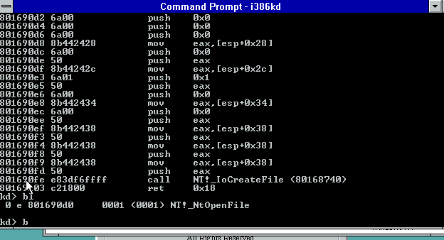
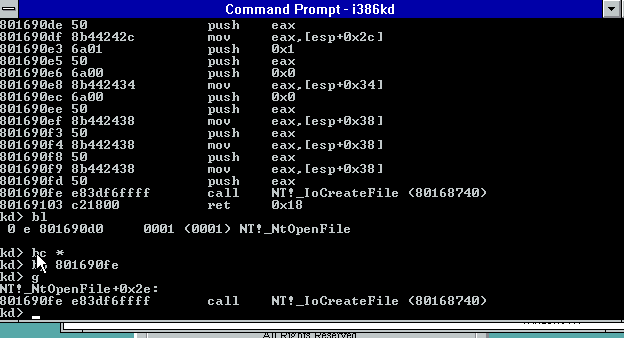

# NtOpenFile — análisis de wrapper sobre IoCreateFile

## Origen de los bytes

Dump crudo capturado desde el debugger kernel (`i386kd`):

```
kd> db 801690d0 L(80169110 - 801690d0)
801690d0  6a 00 6a 00 6a 00 6a 00-8b 44 24 28 6a 00 50 8b  j.j.j.j..D$(j.P.
801690e0  44 24 2c 6a 01 50 6a 00-8b 44 24 34 6a 00 50 8b  D$,j.Pj..D$4j.P.
801690f0  44 24 38 50 8b 44 24 38-50 8b 44 24 38 50 e8 3d  D$8P.D$8P.D$8P.=
80169100  f6 ff ff c2 18 00 8d 49-00 8d a4 24 00 00 00 00  .......I...$....
```

Guardado en `code/dumps/ntopenfile.bin` (bytes crudos) y `code/dumps/ntopenfile.log` (transcript del debugger). Verificado que ambos coinciden byte a byte.

## Desensamblado

| Dirección  | Bytes                  | Instrucción              |
|------------|-------------------------|---------------------------|
| 801690d0   | `6a 00`                | `push 0x0`                |
| 801690d2   | `6a 00`                | `push 0x0`                |
| 801690d4   | `6a 00`                | `push 0x0`                |
| 801690d6   | `6a 00`                | `push 0x0`                |
| 801690d8   | `8b 44 24 28`          | `mov eax, [esp+0x28]`     |
| 801690dc   | `6a 00`                | `push 0x0`                |
| 801690de   | `50`                   | `push eax`                |
| 801690df   | `8b 44 24 2c`          | `mov eax, [esp+0x2c]`     |
| 801690e3   | `6a 01`                | `push 0x1`                |
| 801690e5   | `50`                   | `push eax`                |
| 801690e6   | `6a 00`                | `push 0x0`                |
| 801690e8   | `8b 44 24 34`          | `mov eax, [esp+0x34]`     |
| 801690ec   | `6a 00`                | `push 0x0`                |
| 801690ee   | `50`                   | `push eax`                |
| 801690ef   | `8b 44 24 38`          | `mov eax, [esp+0x38]`     |
| 801690f3   | `50`                   | `push eax`                |
| 801690f4   | `8b 44 24 38`          | `mov eax, [esp+0x38]`     |
| 801690f8   | `50`                   | `push eax`                |
| 801690f9   | `8b 44 24 38`          | `mov eax, [esp+0x38]`     |
| 801690fd   | `50`                   | `push eax`                |
| 801690fe   | `e8 3d f6 ff ff`       | `call 0x80168740`         |
| 80169103   | `c2 18 00`             | `ret 0x18`                |
| 80169106   | `8d 49 00`              | `lea ecx,[ecx+0x0]` (padding) |
| 80169109   | `8d a4 24 00 00 00 00` | `lea esp,[esp+0x0]` (padding) |

**No hay prólogo** (`push ebp`/`mov ebp,esp` o `sub esp,N`): la función arranca directo con `push` y direcciona todo vía `[esp+N]`, sin frame pointer (build optimizado, FPO). Esto confirma que `801690d0` es el **primer byte** de `NtOpenFile` — en ese punto `esp` apunta a la dirección de retorno del caller.

Confirmado en vivo con `u` (desensamblado del propio debugger, coincide instrucción a instrucción con la tabla de arriba) y con un breakpoint en `NtOpenFile` que cae justo en el `call`:




En ambas capturas, `i386kd` resuelve `80168740` directo como `NT!_IoCreateFile` — confirma sin ambigüedad que la función **sí tiene símbolo público** (no hubo que inferir el nombre por firma/comportamiento).

## Reconstrucción del stack (orden de push, ESP relativo a la entrada de la función = `ESP0`)

`NtOpenFile(FileHandle, DesiredAccess, ObjectAttributes, IoStatusBlock, ShareAccess, OpenOptions)` — stdcall, 6 args:

| Offset desde ESP0 | Contenido en `[ESP0+N]` |
|---|---|
| +0x00 | dirección de retorno |
| +0x04 | arg1 `FileHandle` |
| +0x08 | arg2 `DesiredAccess` |
| +0x0C | arg3 `ObjectAttributes` |
| +0x10 | arg4 `IoStatusBlock` |
| +0x14 | arg5 `ShareAccess` |
| +0x18 | arg6 `OpenOptions` |

Siguiendo cada `push`/`mov` y recalculando el offset real contra `ESP0` (restando lo que ya se apiló), el stack que se arma para el `call 0x80168740` queda así, **en orden cronológico de push** (que en `stdcall` es el último parámetro del callee primero):

| # push | Valor | Origen | Parámetro de `IoCreateFile` (hipótesis) |
|---|---|---|---|
| 1 | `0x0` | inmediato | `Options` = 0 |
| 2 | `0x0` | inmediato | `ExtraCreateParameters` = NULL |
| 3 | `0x0` | inmediato | `CreateFileType` = `CreateFileTypeNone` (0) |
| 4 | `0x0` | inmediato | `EaLength` = 0 |
| 5 | `0x0` | inmediato | `EaBuffer` = NULL |
| 6 | `eax` = `[ESP0+0x18]` | **arg6 forward** | `CreateOptions` = `OpenOptions` |
| 7 | `0x1` | inmediato | `Disposition` = `FILE_OPEN` (1) |
| 8 | `eax` = `[ESP0+0x14]` | **arg5 forward** | `ShareAccess` = `ShareAccess` |
| 9 | `0x0` | inmediato | `FileAttributes` = 0 |
| 10 | `0x0` | inmediato | `AllocationSize` = NULL |
| 11 | `eax` = `[ESP0+0x10]` | **arg4 forward** | `IoStatusBlock` = `IoStatusBlock` |
| 12 | `eax` = `[ESP0+0x0C]` | **arg3 forward** | `ObjectAttributes` = `ObjectAttributes` |
| 13 | `eax` = `[ESP0+0x08]` | **arg2 forward** | `DesiredAccess` = `DesiredAccess` |
| 14 | `eax` = `[ESP0+0x04]` | **arg1 forward** | `FileHandle` = `FileHandle` |

**14 pushes = 56 bytes = 14 dwords**, exactamente la firma completa de `IoCreateFile`:

```c
NTSTATUS IoCreateFile(
    PHANDLE            FileHandle,        // forward arg1
    ACCESS_MASK        DesiredAccess,     // forward arg2
    POBJECT_ATTRIBUTES ObjectAttributes,  // forward arg3
    PIO_STATUS_BLOCK   IoStatusBlock,     // forward arg4
    PLARGE_INTEGER     AllocationSize,    // NULL
    ULONG              FileAttributes,    // 0
    ULONG              ShareAccess,       // forward arg5
    ULONG              Disposition,       // FILE_OPEN (1) — constante
    ULONG              CreateOptions,     // forward arg6 (OpenOptions)
    PVOID              EaBuffer,          // NULL
    ULONG              EaLength,          // 0
    CREATE_FILE_TYPE   CreateFileType,    // CreateFileTypeNone (0)
    PVOID              ExtraCreateParameters, // NULL
    ULONG              Options            // 0
);
```

## Conclusión

- `NtOpenFile` es, tal cual se sospechaba, un **wrapper delgado sin lógica propia**: solo arma el stack de `IoCreateFile` completando los 8 parámetros que `NtOpenFile` no expone con constantes fijas (`FILE_OPEN`, `CreateFileTypeNone`, NULLs, ceros) y reenvía sus 6 argumentos tal cual.
- `ret 0x18` (24 = 6×4 bytes) confirma el cierre del frame de `NtOpenFile` con sus 6 parámetros stdcall — cierra el análisis del límite de la función.
- El padding final (`8d 49 00` / `8d a4 24 00000000`, formas de NOP multi-byte típicas de MSVC) alinea el próximo símbolo, patrón normal en builds de esta época.
- **Pendiente:** desensamblar `0x80168740` para confirmar que efectivamente es `IoCreateFile` (o un thunk intermedio) y verificar que la firma de 14 parámetros coincide en el otro extremo (prólogo que accede a `[ebp+0x38]` como último arg, etc).

## Siguientes pasos

- [x] Confirmar si `IoCreateFile` es exportada/tiene símbolo público — sí, `i386kd` resuelve `80168740` directo como `NT!_IoCreateFile` (ver capturas arriba).
- [x] Volcar `db 80168740 L(80168c70-80168740)` y repetir este mismo proceso sobre `IoCreateFile` — hecho, ver `code/dumps/iocreatefile.bin` / `code/dumps/iocreatefile.log`.
- [ ] Importar `iocreatefile.bin` en Ghidra en la dirección base real (`0x80168740`) y decompilar con `scripts/DecompileDump.java` (script headless de `DecompInterface`, ver metodología de análisis en el proyecto).
- [ ] Correlacionar direcciones (`801690d0`, `80168740`) contra la base de carga de `ntoskrnl.exe` para mapearlas a offsets de archivo si se quiere anotar en Ghidra sobre el binario en disco.

## IoCreateFile — análisis en curso

Pendiente de documentar acá. El dump crudo y el script de decompile ya están en el repo (`code/dumps/iocreatefile.{bin,log}`, `scripts/DecompileDump.java`); falta el análisis del cuerpo de la función.
