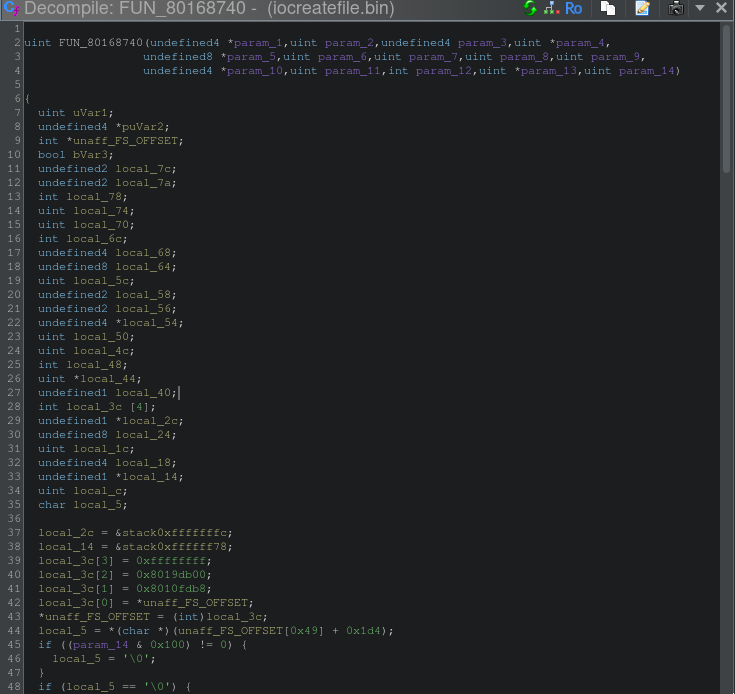
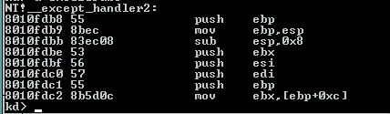
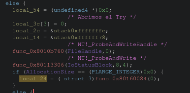
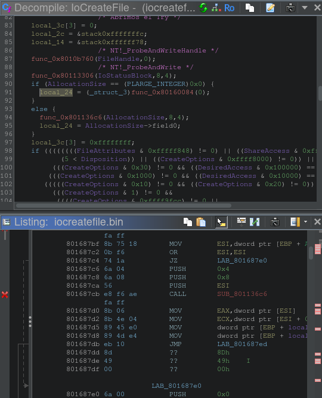
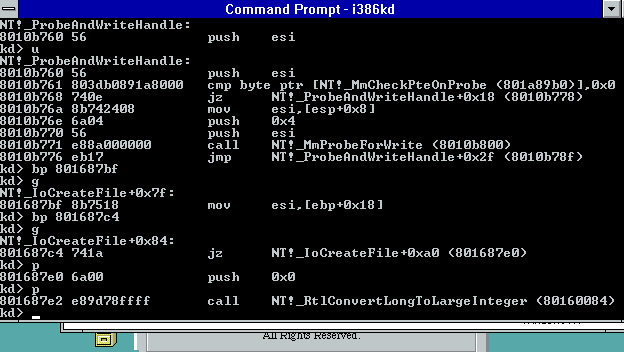

# IoCreateFile — reversing del kernel NT 3.1

**Función objetivo:** `NT!_IoCreateFile` en `ntoskrnl.exe` (build 3.10.5098.1)  
**Dirección base:** `0x80168740`  
**Herramientas:** Ghidra 11 + `i386kd` (kernel debugger NT 3.1)

---

## 1. Reconstrucción de tipos DDK auténticos para Ghidra

El primer obstáculo fue que Ghidra no conoce los tipos NT internos (`IO_STATUS_BLOCK`, `OBJECT_ATTRIBUTES`, `KPROCESSOR_MODE`, etc.). Los headers modernos de WDK no sirven porque las estructuras cambiaron. Necesitamos los headers originales de **NT DDK octubre 1994**.

### Proceso para generar el `.gdt`

```bash
# 1. Crear symlinks en minúscula para los headers en mayúscula
for dir in ddk_extract/INC vc_extract/INCLUDE; do
  (cd "$dir" && for f in *; do
    lower=$(echo "$f" | tr '[:upper:]' '[:lower:]')
    [ "$f" != "$lower" ] && [ ! -e "$lower" ] && ln -s "$f" "$lower"
  done)
done

# 2. Preprocesar a un .h plano con gcc -E
gcc -E -xc -I ddk_extract/INC -I vc_extract/INCLUDE \
    -D_X86_ -Di386 ntddk_wrapper.c -o ntddk_flat.i

# 3. Limpiar líneas # y __declspec
sed -i -E \
  -e '/^# [0-9]/d' \
  -e '/^#pragma/d' \
  -e 's/__declspec\([^)]*\)//g' ntddk_flat.i

# Renombrar para que Ghidra lo acepte
cp ntddk_flat.i ntddk_flat.h
```

**`ntddk_wrapper.c`** incluye `<ntddk.h>` y agrega manualmente el prototipo de `IoCreateFile` (no está declarado en el DDK público de 1994, solo aparece en comentarios):

```c
NTSTATUS
IoCreateFile(
    OUT PHANDLE FileHandle,
    IN ACCESS_MASK DesiredAccess,
    IN POBJECT_ATTRIBUTES ObjectAttributes,
    OUT PIO_STATUS_BLOCK IoStatusBlock,
    IN PLARGE_INTEGER AllocationSize OPTIONAL,
    IN ULONG FileAttributes,
    IN ULONG ShareAccess,
    IN ULONG Disposition,
    IN ULONG CreateOptions,
    IN PVOID EaBuffer OPTIONAL,
    IN ULONG EaLength,
    IN CREATE_FILE_TYPE CreateFileType,
    IN PVOID ExtraCreateParameters OPTIONAL,
    IN ULONG Options
    );
```

Luego en Ghidra: **File → Parse C Source** → agregar `ntddk_flat.h` → **Parse to Program** → guarda como `nt31_ddk.gdt` en el Data Type Manager.

---

## 2. Firma de la función

`IoCreateFile` recibe **14 parámetros** (stdcall):

| # | Nombre | Tipo | Descripción |
|---|--------|------|-------------|
| 1 | `FileHandle` | `PHANDLE` | OUT — handle resultante |
| 2 | `DesiredAccess` | `ACCESS_MASK` | permisos solicitados |
| 3 | `ObjectAttributes` | `POBJECT_ATTRIBUTES` | nombre, atributos |
| 4 | `IoStatusBlock` | `PIO_STATUS_BLOCK` | OUT — resultado de la operación |
| 5 | `AllocationSize` | `PLARGE_INTEGER` | tamaño inicial (opcional) |
| 6 | `FileAttributes` | `ULONG` | atributos del archivo |
| 7 | `ShareAccess` | `ULONG` | compartición |
| 8 | `Disposition` | `ULONG` | CREATE/OPEN/TRUNCATE... |
| 9 | `CreateOptions` | `ULONG` | opciones del IRP |
| 10 | `EaBuffer` | `PVOID` | Extended Attributes (opcional) |
| 11 | `EaLength` | `ULONG` | longitud del EaBuffer |
| 12 | `CreateFileType` | `CREATE_FILE_TYPE` | None / NamedPipe / Mailslot |
| 13 | `ExtraCreateParameters` | `PVOID` | parámetros extra (opcional) |
| 14 | `Options` | `ULONG` | flags internos del kernel |

Pseudocódigo de Ghidra tras aplicar los tipos DDK:



---

## 3. Determinación de RequestorMode

Lo primero que hace la función es saber desde dónde fue llamada: ¿kernel o usermode?

```c
// Leer PreviousMode del KTHREAD actual
// FS:[0x124] = KPCR->PrcbData.CurrentThread (puntero al KTHREAD)
// KTHREAD+0x1d4 = PreviousMode (KPROCESSOR_MODE)
local_5 = *(char *)(unaff_FS_OFFSET[0x49] + 0x1d4);

// Flag IO_NO_PARAMETER_CHECKING (0x100):
// Si está presente, forzar KernelMode sin importar el caller real
if ((param_14 & 0x100) != 0) {
    local_5 = '\0';  // KernelMode = 0
}
```

- `KernelMode = 0` → el caller es de confianza, no se validan punteros
- `UserMode = 1` → el caller viene de ring 3, hay que validar todo

---

## 4. Estructura SEH — el frame de excepción MSVC

`IoCreateFile` usa `__try/__except` para proteger los accesos a memoria de usermode. El compilador MSVC para x86 implementa esto con una cadena de registros de excepción instalados en `FS:[0]`.

### Layout del frame en el stack

El array `local_3c[4]` mapea el registro de excepción MSVC:

| Índice | Offset (ebp) | Campo | Valor |
|--------|-------------|-------|-------|
| `[0]` | `[ebp-0x38]` | `Next` | puntero al frame anterior en `FS:[0]` |
| `[1]` | `[ebp-0x34]` | `Handler` | `0x8010fdb8` = `_except_handler3` |
| `[2]` | `[ebp-0x30]` | `ScopeTable` | `0x8019db00` |
| `[3]` | `[ebp-0x2c]` | `TryLevel` | `-1` = inactivo, `0` = try#0, `1` = try#1 |

Ghidra muestra los valores hardcodeados antes de instalar el frame:


Assembly real capturado con `i386kd` mostrando cómo el compilador instala el frame en `FS:[0]`:


### ScopeTable en `0x8019db00`

La ScopeTable describe los dos bloques `__try` independientes de la función:

```
kd> dd 8019db00 L6
8019db00: ffffffff 801688b8 801688c8
8019db0c: ffffffff 801689c6 801689d6
```

| TryLevel | PreviousTryLevel | Filter | HandlerBlock |
|----------|-----------------|--------|--------------|
| 0 | `0xffffffff` (-1) | `0x801688b8` | `0x801688c8` |
| 1 | `0xffffffff` (-1) | `0x801689c6` | `0x801689d6` |

- **`PreviousTryLevel = -1`** en ambos: son bloques independientes (no anidados).
- **Filter**: función que evalúa la excepción. Si devuelve `1` (`EXCEPTION_EXECUTE_HANDLER`) → ejecutar el handler.
- **HandlerBlock**: código del `__except { }` que se ejecuta si el filter lo aprueba.
- **TryLevel = 0** activa el try#0; **TryLevel = -1** indica que no hay try activo.

`_except_handler2` capturado en i386kd (el dispatcher de excepciones del runtime MSVC):



---

## 5. Flujo del else — rama UserMode

Cuando `RequestorMode == UserMode` (≠ `'\0'`), la función debe validar que todos los punteros que recibió de usermode son realmente escribibles antes de usarlos. Progresión completa del bloque en Ghidra — desde el primer pase (`func_0x...` sin renombrar) hasta las cuatro funciones ya identificadas (`ProbeAndWriteHandle`, `ProbeForWrite`, `RtlConvertLongToLargeInteger`, `ProbeForRead`) y el panel de Listing correlacionando la dirección real:





### ¿Qué hace `Probe` realmente?

Es clave no confundir esto: **`Probe` no copia nada, solo valida** — es un gate de permisos que corre *antes* de tocar la memoria. Para cada rango `[Address, Address+Length)` verifica tres cosas:

1. **Que la dirección caiga en espacio de usermode** (por debajo de `0x80000000` en este build) y no en espacio del kernel. Esto es lo central: el kernel corre con acceso total a *toda* la memoria, kernel y usuario. Sin este chequeo, un proceso podría pasar una dirección del kernel disfrazada de "mi handle de salida", y el kernel — que tiene permiso de sobra — terminaría escribiendo ahí a pedido de usermode. `Probe` es lo que bloquea ese primitivo de escalada de privilegios.
2. **Alineación** — el `4` que se repite en cada llamada, acorde al tipo que se está validando.
3. **Que la página esté presente y con el permiso correcto** (legible para `ProbeForRead`, escribible para `ProbeForWrite`) — si no lo está, ahí es donde salta `STATUS_ACCESS_VIOLATION`, capturado por el `__try/__except` de la Sección 4. El frame SEH existe *específicamente* para esto.

La copia a una variable local (`local_24 = AllocationSize->field0`, o el `*FileHandle = 0` de más abajo) es un paso **separado**, que hace `IoCreateFile` recién después de que `Probe` dio el visto bueno — es la defensa contra TOCTOU (*time-of-check to time-of-use*): otro hilo del mismo proceso podría modificar o desmapear esa memoria microsegundos después de validada, así que el valor se copia a memoria del kernel (fuera del alcance de usermode) una sola vez y el resto de la función ya no vuelve a tocar el puntero original.

### ProbeAndWriteHandle (`0x8010b760`)

Confirmado con `i386kd` — disassembly real:

```
NT!_ProbeAndWriteHandle:
8010b760  push    esi
8010b761  cmp byte ptr [NT!_MmCheckPteOnProbe], 0x0
8010b768  jz      +0x18
8010b76a  mov     esi, [esp+0x8]      ; esi = Address (FileHandle)
8010b76e  push    0x4                 ; alignment
8010b770  push    esi                 ; Address
8010b771  call    NT!_MmProbeForWrite ; valida escribibilidad
8010b776  jmp     +0x2f               ; → escribir el valor
```

Verifica que `MmCheckPteOnProbe` esté activo, llama a `MmProbeForWrite(Address, 4)` para garantizar que el puntero pertenece a usermode y es escribible, luego escribe `0` como valor inicial en `*FileHandle`.

### ProbeForWrite (`0x80113306`)

Llamada como `ProbeForWrite(IoStatusBlock, 8, 4)`:
- Puntero: `IoStatusBlock`
- Longitud: `8` bytes (tamaño de `IO_STATUS_BLOCK`)
- Alineación: `4` bytes

Valida que `IoStatusBlock` está completamente en espacio de usuario y es escribible.

**Por qué acá es solo `ProbeForWrite` y no `ProbeAndWrite` como con `FileHandle`:** `IoStatusBlock` es el resultado *final* de la operación (`Status`/`Information`) — algo que en este punto de la función todavía no existe. El valor real recién se conoce mucho más adelante, adentro de `IopCreateFile`, después de que el filesystem driver completa el IRP (potencialmente de forma asíncrona). El trabajo se divide en dos: **validar ya** (fail-fast — mejor descubrir un puntero inválido acá, con un error simple, que mil líneas después en medio de una IRP ya en curso) y **escribir después**, cuando el resultado real esté disponible.

### RtlConvertLongToLargeInteger (`0x80160084`)

Cuando `AllocationSize == NULL`, la función crea un `LARGE_INTEGER` de valor cero para usar como tamaño por defecto. `RtlConvertLongToLargeInteger(0)` extiende el entero `0` a 64 bits.

Confirmado en vivo con un breakpoint en `IoCreateFile+0x84`: el `jz` salta directo al `push 0x0` + `call NT!_RtlConvertLongToLargeInteger`, saltándose por completo la rama de `ProbeForRead` — la prueba de que cuando `AllocationSize` es `NULL` nunca se toca memoria de usermode para este parámetro:



### ProbeForRead (`0x801136c6`)

Rama `else` — cuando el caller sí mandó un `AllocationSize` real (`!= NULL`), visible en la captura de arriba: `ProbeForRead(AllocationSize, 8, 4)` seguido de `local_24 = AllocationSize->field0`. Mismo patrón que `ProbeForWrite`, pero para **lectura**: valida que los 8 bytes de `AllocationSize` son legibles desde usermode antes de desreferenciarlos. Recién con el puntero validado, `local_24 = AllocationSize->field0` copia el valor a la variable local del kernel — la misma defensa TOCTOU explicada arriba: se lee una sola vez, apenas validado, y el resto de la función ya no vuelve a tocar `AllocationSize` directamente.

---

## 6. Flujo completo de IoCreateFile

```
IoCreateFile(FileHandle, DesiredAccess, ObjectAttributes, IoStatusBlock,
             AllocationSize, FileAttributes, ShareAccess, Disposition,
             CreateOptions, EaBuffer, EaLength, CreateFileType,
             ExtraCreateParameters, Options)
│
├─ 1. Leer KTHREAD->PreviousMode desde FS:[0x124]+0x1d4
│     Si Options & 0x100 (IO_NO_PARAMETER_CHECKING) → forzar KernelMode
│
├─ 2. Si KernelMode → sin validaciones (el kernel se fía de sí mismo)
│
└─ 3. Si UserMode:
      ├─ Abrir try#0 (TryLevel = 0)
      ├─ ProbeAndWriteHandle(FileHandle, 0)     → pre-zerear + validar
      ├─ ProbeForWrite(IoStatusBlock, 8, 4)     → validar IoStatusBlock
      ├─ Si AllocationSize == NULL → RtlConvertLongToLargeInteger(0)
      │  Si no  → ProbeForRead(AllocationSize, 8, 4) + copiar a local_24
      ├─ Validación gigante de FileAttributes/ShareAccess/Disposition/CreateOptions/
      │  DesiredAccess → si algo no cierra, STATUS_INVALID_PARAMETER (Sección 8)
      ├─ Si CreateFileType != None → validar NamedPipe/Mailslot (Sección 9)
      ├─ Si EaBuffer != NULL:
      │   └─ Abrir try#1 (TryLevel = 1)
      │       ProbeForRead(EaBuffer, EaLength) + copiar al kernel heap
      └─ Llamar IopCreateFile(...)  ← el trabajo real
```

**Idea central:** `IoCreateFile` es un guardia de seguridad. Valida que los punteros de usermode son legítimos antes de pasarlos al motor real (`IopCreateFile`), todo protegido con `__try/__except` para capturar cualquier acceso inválido.

---

## 7. Flags internos (parámetro `Options`)

Definidos en `NTDDK.H` (DDK octubre 1994):

```c
#define IO_FORCE_ACCESS_CHECK    0x0001
#define IO_OPEN_PAGING_FILE      0x0002
#define IO_OPEN_TARGET_DIRECTORY 0x0004
// 0x0100 = IO_NO_PARAMETER_CHECKING (interno, no declarado públicamente)
```

El flag `0x100` es el único que afecta el flujo de `IoCreateFile` directamente: fuerza `KernelMode` saltando todas las validaciones de usermode.

---

## 8. Validación de parámetros — el `if` gigante

Después de resolver `AllocationSize` (Sección 5), y antes de tocar `EaBuffer` o llamar a `IopCreateFile`, la función corre un único `if` con toda la validación cruzada de `FileAttributes`, `ShareAccess`, `Disposition`, `CreateOptions` y `DesiredAccess`. Si cualquier condición da cierto, corta con `STATUS_INVALID_PARAMETER`:


`0xc000000d` está confirmado en `NTSTATUS.H` del DDK:

```c
#define STATUS_INVALID_PARAMETER         ((NTSTATUS)0xC000000DL)
```

`LAB_80168c55` es el punto de salida de error común de la función — cierra el `__try` y retorna sin haber llamado nunca a `IopCreateFile`.

### Los tres niveles de validación

La expresión mezcla tres tipos de chequeo distintos:

1. **Validez de un solo campo** — ¿el valor, aislado, es basura?
2. **Mutua exclusión dentro de un mismo campo** — ¿pidió dos cosas contradictorias en el mismo parámetro?
3. **Coherencia entre campos** — ¿lo que pidió en un parámetro tiene sentido dado lo que pidió en otro?

### 1. Validez individual de cada campo

**`(FileAttributes & 0xfffff848) != 0`** — complemento de `0x7B7`. Confirmado contra `winnt.h`, calza exacto con los 9 atributos válidos del DDK de 1994:

```c
#define FILE_ATTRIBUTE_READONLY         0x00000001
#define FILE_ATTRIBUTE_HIDDEN           0x00000002
#define FILE_ATTRIBUTE_SYSTEM           0x00000004
#define FILE_ATTRIBUTE_DIRECTORY        0x00000010
#define FILE_ATTRIBUTE_ARCHIVE          0x00000020
#define FILE_ATTRIBUTE_NORMAL           0x00000080
#define FILE_ATTRIBUTE_TEMPORARY        0x00000100
#define FILE_ATTRIBUTE_ATOMIC_WRITE     0x00000200
#define FILE_ATTRIBUTE_XACTION_WRITE    0x00000400
```

`ATOMIC_WRITE`/`XACTION_WRITE` son vestigios del diseño original de archivos transaccionales de NT, abandonado casi por completo — sobrevivieron como flags aceptados sin efecto real.

**`(ShareAccess & 0xfffffff8) != 0`** — complemento de `0x7`. El header solo documenta dos flags públicos:

```c
#define FILE_SHARE_READ                 0x00000001
#define FILE_SHARE_WRITE                0x00000002
```

pero la máscara del kernel ya deja pasar un tercer bit (`0x4`) sin nombre público en este DDK — casi con certeza el precursor de lo que en versiones posteriores de NT se documentó como `FILE_SHARE_DELETE`.

**`(5 < Disposition)`** — a diferencia de los anteriores no es una máscara de bits, es un rango: `Disposition` es un valor enumerado secuencial (`0`-`5`), y el header confirma el límite con su propia constante:

```c
#define FILE_MAXIMUM_DISPOSITION        0x00000005
```

**`(CreateOptions & 0xffff8000) != 0`** — complemento exacto de una constante que el propio DDK ya nombra:

```c
#define FILE_VALID_OPTION_FLAGS          0x00007FFF
```

### 2. Mutua exclusión dentro de un mismo campo

**`(CreateOptions & 0x10) != 0 && (CreateOptions & 0x20) != 0`** — `FILE_SYNCHRONOUS_IO_ALERT` y `FILE_SYNCHRONOUS_IO_NONALERT` no pueden estar los dos prendidos: son dos modos alternativos del mismo flag `Alertable` que `KeWaitForSingleObject` recibe internamente — alertable (la espera se puede interrumpir con una APC en cola) vs. no-alertable (ignora APCs pendientes hasta que termine la I/O). Pedir los dos es una contradicción lógica, no una combinación válida.

### 3. Coherencia entre campos

**`(CreateOptions & 0x30) != 0 && (DesiredAccess & 0x100000) == 0`** — pidió I/O síncrono (`0x30` = `SYNC_ALERT | SYNC_NONALERT`) pero no pidió `SYNCHRONIZE` (`0x100000`) al abrir el handle. Un file object se puede esperar como cualquier otro kernel object (evento, mutex) — para que el I/O Manager señalice y el caller pueda bloquearse hasta que termine, el handle necesita el derecho `SYNCHRONIZE`, igual que necesitarías ese derecho para un `WaitForSingleObject`.

**`(CreateOptions & 0x1000) != 0 && (DesiredAccess & 0x10000) == 0`** — pidió `FILE_DELETE_ON_CLOSE` (`0x1000`) pero no pidió `DELETE` (`0x10000`) en `DesiredAccess`. Es la regla documentada de la API: no podés marcar un archivo para que se borre solo al cerrar el handle si nunca pediste permiso de borrado al abrirlo — de lo contrario sería una forma de esquivar el chequeo de autorización normal de un delete.

**`(CreateOptions & 8) != 0 && (DesiredAccess & 4) != 0`** — `FILE_NO_INTERMEDIATE_BUFFERING` (I/O sin caché, todo alineado a sector) junto con `FILE_APPEND_DATA` (el kernel decide automáticamente que cada write cae al EOF actual). *(Hipótesis, no confirmada mirando `IopCreateFile`)*: el EOF de un archivo no tiene por qué caer en un límite de sector, así que delegarle al kernel la posición del write y a la vez exigir alineación estricta de sector son responsabilidades que se contradicen.

### Bloque especial: apertura de directorios

**`(CreateOptions & 1) != 0`** (`FILE_DIRECTORY_FILE`) actúa como *gate*, no como negación — activa un sub-bloque de reglas que solo aplican cuando se pide explícitamente un directorio:

**`(CreateOptions & 0xffff9fcc) != 0`** — complemento de `0x6033`, que son exactamente estos seis flags:

```
0x0001  FILE_DIRECTORY_FILE
0x0002  FILE_WRITE_THROUGH
0x0010  FILE_SYNCHRONOUS_IO_ALERT
0x0020  FILE_SYNCHRONOUS_IO_NONALERT
0x2000  FILE_OPEN_BY_FILE_ID
0x4000  FILE_OPEN_FOR_BACKUP_INTENT
```

Cualquier otro bit de `CreateOptions` (buffering, oplocks, EAs — todo lo que aplica a *contenido* de archivo, no a un directorio) es inválido acá. De yapa, esto atrapa sin chequeo aparte la contradicción `FILE_DIRECTORY_FILE` + `FILE_NON_DIRECTORY_FILE` (`0x40`), porque `0x40` tampoco está en el set válido.

**`Disposition != 2 && Disposition != 1 && Disposition != 3`** — para un directorio solo se permiten `FILE_OPEN`, `FILE_CREATE`, `FILE_OPEN_IF`. Los tres rechazados (`FILE_SUPERSEDE`, `FILE_OVERWRITE`, `FILE_OVERWRITE_IF`) implican reemplazar/truncar contenido — algo que no existe para un directorio.

**`(DesiredAccess & 6) != 0`** — `FILE_ADD_FILE`/`FILE_ADD_SUBDIRECTORY` (mismos bits que `FILE_WRITE_DATA`/`FILE_APPEND_DATA`, pero renombrados para un directorio según `winnt.h`). *(Hipótesis, no confirmada)*: probablemente estos derechos se evalúan contra el ACL del directorio cuando alguien más tarde crea algo adentro (abriendo el path hijo), no algo que tenga sentido pedir directamente al abrir el handle del directorio en sí.

---

## 9. Validación específica por `CreateFileType` (NamedPipe / Mailslot)

Un segundo bloque de validación, estructuralmente separado del `if` gigante de la Sección 8, cubre los dos tipos especiales de `CreateFileType` (recordar el enum de la Sección 2 — `CreateFileTypeNone = 0`, `CreateFileTypeNamedPipe = 1`, `CreateFileTypeMailslot = 2`, confirmado en `NTDDK.H`):


El `if (CreateFileType != CreateFileTypeNone)` de afuera es un *guard clause*, no una regla de negocio — a diferencia de los bitmasks de la Sección 8, `CreateFileType` es un enum de un solo valor, así que "no es None" y "es NamedPipe" no son dos condiciones independientes: si es `NamedPipe`, automáticamente ya es distinto de `None`. El gate solo existe para saltear todo el bloque en el caso común (abrir un archivo normal).

### Bloque `NamedPipe`

Primero, `ExtraCreateParameters == NULL` → inválido (un pipe necesita esos parámetros extra para poder crearse). Después, un segundo `if` valida:

- **Tres campos dentro de la estructura apuntada por `ExtraCreateParameters`** (offsets `0x0`, `0x4`, `0x8`), cada uno rechazado si vale más de `1`. No están en el DDK público de 1994 (es un detalle interno compartido entre el I/O Manager y `NPFS.SYS`), pero por documentación de NT bien conocida — *sin confirmar contra un header de esta build* — corresponden a:
  ```c
  typedef struct _NAMED_PIPE_CREATE_PARAMETERS {
      ULONG NamedPipeType;    // offset 0x0 — 0 = byte stream, 1 = message
      ULONG ReadMode;         // offset 0x4 — 0 = byte,       1 = message
      ULONG CompletionMode;   // offset 0x8 — 0 = queue,      1 = complete
      ...
  } NAMED_PIPE_CREATE_PARAMETERS;
  ```
  Los tres son enums booleanos disfrazados de `ULONG` — mismo patrón "Tipo 1" de la Sección 8 (validez de un campo aislado), aplicado a campos de una estructura en vez de a un parámetro directo.
- **`ShareAccess & 4`** — el mismo bit sin nombre público de la Sección 8 (precursor de `FILE_SHARE_DELETE`): un pipe no tiene semántica de "borrado" tipo archivo, se rechaza.
- **`Disposition == 0`** (`FILE_SUPERSEDE`) combinado con `3 < Disposition` más abajo: el único rango que sobrevive es `1`-`3` (`FILE_OPEN`/`FILE_CREATE`/`FILE_OPEN_IF`) — mismo trío que quedó habilitado para directorios, porque un pipe tampoco tiene contenido para reemplazar.
- **`CreateOptions & 0xffffffcd`** — complemento de `0x32`: solo `FILE_WRITE_THROUGH`, `FILE_SYNCHRONOUS_IO_ALERT`, `FILE_SYNCHRONOUS_IO_NONALERT` son válidos, un set todavía más chico que el de directorios.

### Bloque `Mailslot`

Misma estructura (`ExtraCreateParameters == NULL` → inválido primero), pero sin el chequeo de campos internos — la estructura de mailslot no tiene esos tres enums booleanos. El segundo `if` valida:

- **`ShareAccess & 4`** — mismo motivo que `NamedPipe`.
- **`ShareAccess & 0xfffffffd) == 0`** — la primera vez que aparece `== 0` en vez de `!= 0`: la máscara `0xfffffffd` (complemento de `0x2`, `FILE_SHARE_WRITE`) agarra *todos los demás bits* de `ShareAccess`. Que el resultado sea `0` significa que no hay ningún bit prendido salvo, como mucho, `0x2` — en la práctica, exige que `FILE_SHARE_READ` (`0x1`) esté presente. *(Hipótesis, no confirmada)*: probablemente porque los clientes que le escriben mensajes al mailslot necesitan su propio handle de lectura simultáneo.
- **`Disposition != 2`** — a diferencia de `NamedPipe`, un mailslot **solo** admite `FILE_CREATE`. No existe "conectarse" a un mailslot existente por esta vía — eso se hace abriendo el path como archivo común (`CreateFileTypeNone`).
- **`CreateOptions & 0xffffffcd`** — mismo set válido que `NamedPipe`.

---

## 10. Bloque `EaBuffer` — try#1 (última parte de la rama UserMode)

Última pieza de la rama `else` (`UserMode`) que arrancó en la Sección 5 — el segundo bloque `__try` independiente de la ScopeTable (Sección 4, `TryLevel = 1`), justo antes de armar los parámetros para el motor real de creación:


**Qué es `EaBuffer`:** parámetro 10, `PVOID` opcional a una cadena de **Extended Attributes** (EAs) — un resabio directo del **HPFS de OS/2**, heredado por compatibilidad con el subsistema OS/2 de NT. Cada EA es una `FILE_FULL_EA_INFORMATION` (confirmado en `NTDDK.H`: `NextEntryOffset`, `Flags`, `EaNameLength`, `EaValueLength`, `EaName[]` seguido del valor crudo), encadenadas entre sí. `EaLength` (parámetro 11) es el tamaño total en bytes de la cadena.

**El gate:** `if (EaBuffer == NULL || EaLength == 0)` → caso vacío, `local_54 = NULL` y `local_50 = 0` (el par "buffer de EA ya copiado al kernel + su tamaño" que la función arma acá, sea vacío o real, y que viaja hacia el motor de creación en vez del `EaBuffer` original de usermode). Nota: la etiqueta `LAB_80168a60` cae justo dentro de este caso vacío — hay otro punto de la función, no visto en esta captura, que salta directo acá sin pasar por el chequeo.

**Rama `else` (EA real, no reverseada por ahora):** cuando sí hay EAs, el bloque llama `ProbeForRead(EaBuffer, EaLength, 4)` (misma dirección `0x801136c6` que ya identificamos), reserva un buffer del kernel, copia el contenido a mano (DWORD a DWORD y después byte a byte), y valida el formato de la cadena con lo que parece ser `IoCheckEaBufferValidity` (firma `buffer, length, &ErrorOffset` — coincide con la función real documentada de NT). Queda pendiente de reversear en detalle — es la rama de compatibilidad con OS/2, no el camino común.

**Confirmación en vivo con `i386kd`:** con un breakpoint en `IoCreateFile` (`bp 80168740`) disparado desde `hello.exe`, `dd esp L4` mostró la dirección de retorno como `80169103` — coincide *exacto* con el valor calculado a mano en la Fase 4 (`801690fe` + 5 bytes de `call` = `80169103`), confirmando en vivo que este `IoCreateFile` fue invocado desde `NtOpenFile`. Siguiendo la ejecución hasta la zona del `if` gigante y el gate de `CreateFileType`, el disassembly confirmó en vivo los offsets exactos de varios parámetros contra el frame (`ebp+0x8 + 4×(n-1)`), validando la aritmética que veníamos usando solo por cálculo:

| Parámetro | Offset confirmado |
|---|---|
| `DesiredAccess` (2) | `[ebp+0xC]` |
| `Disposition` (8) | `[ebp+0x24]` |
| `CreateOptions` (9) | `[ebp+0x28]` |
| `EaBuffer` (10) | `[ebp+0x2C]` |
| `CreateFileType` (12) | `[ebp+0x34]` |

En esta corrida en particular, `hello.exe` no usa Extended Attributes: `EaBuffer` llegó `NULL`, confirmando en vivo que se toma la rama vacía del gate.

---

## Referencias

- NT DDK octubre 1994 — `ddk_extract/INC/NTDDK.H`
- `ntoskrnl.exe` build 3.10.5098.1 — base `0x80100000`
- Ghidra 11 — Data Type Manager, Parse C Source
- `i386kd` — debugger kernel NT 3.1
